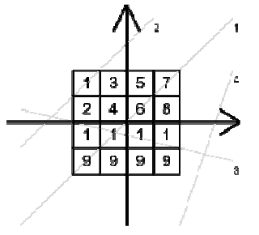

## 문제

U blizini Mirkovog sela nalazi se šuma u kojoj slučajni prolaznici često pronalaze tartufe. Šumu možemo predstaviti kvadratom čija je duljina stranica 2·N metara. Središte kvadrata nalazi se u ishodištu koordinatnog sustava, a stranice kvadrata su paralelne koordinatnim osima.

Kvadrat je podijeljen na 2·N × 2·N jednakih područja, a za svako područje je poznato koliko grama tartufa možemo pronaći ako prošećemo jednim metrom tog područja.

  
Slika prikazuje test primjer

Mirko planira napraviti M šetnji. U jednoj šetnji, Mirko će odabrati neki pravac koji nije paralelan s koordinatnim osima, te prošetati po tom pravcu.

Za svaku šetnju, ispišite koliko ukupno grama tartufa Mirko može pronaći u toj šetnji.

## 입력

U prvom redu nalazi se cijeli broj N (1 ≤ N ≤ 500), polovica širine stranice šume.

U svakom od sljedećih 2·N redova nalazi se po 2·N znakova ‘1’ - ‘9’ koji označavaju broj grama tartufa po prošetanom metru za svako od područja. Područja su navedena od sjevera prema jugu (tj. padajuće po y-koordinati), te od zapada prema istoku (tj. rastuće po x koordinati), kao na slici gore.

U sljedećem redu nalazi se cijeli broj M (1 ≤ M ≤ 2000), broj šetnji.

U svakom od sljedećih M redova nalaze se po četiri cijela broja x1 , y1 , x2 i y2 , koordinate dvije različite točke na pravcu kojim će Mirko prošetati.

Vrijedi: -10000 ≤ x1 , y1 , x2 , y2 ≤ 10000, x1 ≠ x2 , y1 ≠ y2 .

## 출력

Potrebno je ispisati M realnih brojeva na barem 5 decimala, svaki u zaseban redak. i-ti od tih brojeva govori koliko grama tartufa Mirko može pronaći u i-toj šetnji.
