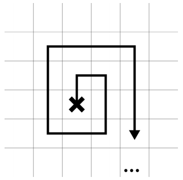

## 문제

U kvadratnu mrežu prosule su se banane. Na raspolaganju nam je majmun kojeg ćemo poslati da ih pokupi. Majmuna bacimo iz helikoptera na neko polje i usmjerimo u jednom od četiri glavna smjera. On napravi korak unaprijed, skrene udesno i dalje se kreće tako da njegova putanja ima oblik spirale.

Slika prikazuje prvi dio majmunove putanje ako ga na početku usmjerimo prema gore. Uočite da se mreža proteže beskonačno u svim smjerovima.

Odredite najmanji broj koraka potreban da majmun pokupi sve banane, ako ga možemo baciti na proizvoljno polje i usmjeriti ga u bilo kojem od četiri smjera. Majmuna ne smijemo baciti na polje na kojem se nalazi banana da se ne posklizne i razbije.

## 입력

U prvom redu ulaza nalazi se prirodni broj N (1 ≤ N ≤ 100000), broj banana.

U svakom od sljedećih N redova nalaze se koordinate jedne banane. Koordinate će biti prirodni brojevi manji od 108 (sto milijuna). U svakom polju može se nalaziti najviše jedna banana.

## 출력

Ispišite jedan prirodni broj, najmanji broj koraka potreban da majmun pokupi sve banane.
