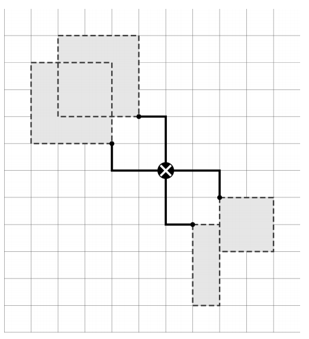

## 문제

U 19. stoljeću električna energija je polako ulazila u opću upotrebu. Jedna od prvih masovnih primjena električne energije je bilo osvjetljenje javnih prostora. Tvrtka Edison Patenti & Krađa inc. odlučila je gradskim vlastima New Yorka pokazati korisnost električne energije osvjetljavanjem značajnijih ulica na Manhattanu. Manhattan ima vrlo pravilnu strukturu koja se sastoji isključivo od ulica (paralelnih s X osi) i avenija (paralelnih s Y osi).

Kako je tehnologija tek u povojima, osvjetljavanje se vrši kvart po kvart. Jedan kvart je pravokutnik čije stranice leže na dvije ulice i dvije avenije. Svaki kvart je opisan nasuprotnim vrhovima pravokutnika, koji uvijek leže na raskrižjima ulica i avenija. Kvartovi se mogu preklapati. Osvjetljavanje svakog kvarta vrši se jednim zatvorenim strujnim krugom, koji zbog ograničenja tehnologije ima samo četiri prekidne točke, po jednu u svakom vrhu kvarta.

Nakon što su odlučili koje kvartove osvjetliti, tvrtka želi pronaći raskrižje na kojem je najpovoljnije postaviti elektranu. Cijena postavljanja elektrane jednaka je zbroju udaljenosti elektrane od svakog kvarta. Udaljenost elektrane od jednog kvarta jednaka je zbroju broja ulica i avenija koje se nalaze između elektrane i najbližeg vrha tog kvarta. Na slici je prikazan jedan mogući odabir kvartova i smještaj elektrane.

Korištenjem tehnologije 21. stoljeća riješite njihov problem te za zadane kvartove odredite najmanju moguću cijenu elektrane.

## 입력

U prvom retku ulaza nalazi se broj N (1 ≤ N ≤ 200000), broj kvartova.

U sljedećih N redaka nalaze se opisi kvartova. Svaki kvart opisan je s četiri koordinate x1 , y1 , x2 i y2 . Vrijedit će x1 < x2 te y1 < y2 . Koordinate će biti prirodni brojevi manji od 107 (deset milijuna).

## 출력

U prvi i jedini redak izlaza potrebno je ispisati jedan broj, najmanju moguću cijenu postavljanja elektrane.
