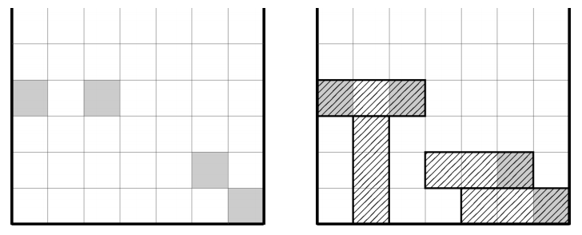

## 문제

테트리스보다 약간 인기가 마이너한 삼트리스 게임에 대해 알아보자. 이 게임에서는 3×1 크기의 막대기만이 등장하고, 화면은 가로 7열이다. 막대기는 화면의 제일 위에서 등장해 아래로 내려오며, 회전시킬 수 있다. 내려오다가 바로 아래 칸이 바닥이거나 내려가야 할 자리에 이미 다른 블록이 존재한다면 그 자리에서 멈추게 된다.

이 게임의 목표 또한 테트리스와는 조금 다르다. 화면에 지정된 N개의 칸을 모두 막대기로 채워 넣으면 게임은 끝난다. 이때 최소 개수의 막대기를 사용하고 싶다. 첫 번째 예제를 나타내면 아래 그림과 같다.

## 입력

첫째 줄에 목표가 되는 칸의 개수 N이 주어진다. (1 ≤ N ≤ 200)

둘째 줄부터 각 칸의 위치가 열 번호, 행 번호 순으로 주어진다. 열 번호는 1 이상 7 이하의 정수이고, 행 번호는 1 이상 108 이하의 정수이다. 화면에서 제일 아래 칸의 행 번호는 1이다.

## 출력

첫째 줄에 문제의 정답을 출력한다.
