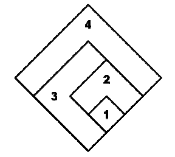

## 문제

U nizu mjera za unapređenje javnog prometa u glavnom gradu, prometno poduzeće odlučilo je promijeniti granice zona javnog prometa. Umjesto dosadašnjeg kružnog modela, prelazi se na romboidni model. Grad je podijeljen na N zona označenih brojevima 1 do N. Zona 1 je kvadrat duljine stranica 1 km sa središtem u samom centru grada. Zona 2 dobivena je širenjem kvadrata zone 1 u jednom od smjerova sjever, istok, zapad ili jug, tako mu duljina stranice bude 2 km. Svaka sljedeća zona dobiva se daljnjim širenjem kvadrata u jednom od navedenih smjerova, tako da se stranica svaki put produlji za 1 km.

Na slici je prikazana jedna moguća podjela grada na 4 zone: za zonu 2 odabran je smjer širenja na sjever, za zonu 3 na zapad, a za zonu 4 ponovno na sjever.

Cijena karte u svakoj zoni odgovara broju susjednih zona koje ju okružuju. Cijene karata u gornjem primjeru su tako 2 kn u zoni 1, 3 kn u zoni 2, 3 kn u zoni 3 te 2 kn u zoni 4.

## 입력

U prvom retku ulaza nalazi se broj N (2 ≤ N ≤ 300 000), broj zona.

U sljedećih N−1 redaka nalazi se jedno od slova 'S', 'I', 'Z', 'J'. Slovo u i-tom retku označava smjer širenja odabran za zonu i.

## 출력

Potrebno je ispisati N redaka, po jedan za svaku zonu. U i-tom retku ispišite cijenu karte u i-toj zoni.
