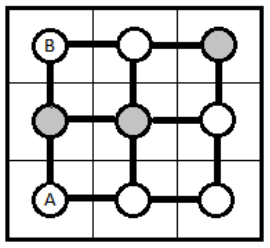

## 문제

Mirko i Slavko idu u četvrti razred gimnazije i bore se za titulu najboljeg matematičara u školi. Osim matematike Mirko se još u slobodno vrijeme bavi informatikom, a Slavko fizikom. Kako su obojica imala sto posto riješene sve ispite iz matematike tokom školske godine, profesorica im je odlučila zadati jedan težak zadatak, a onaj tko ponudi precizniji odgovor nosit će titulu najboljeg matematičara škole. Zadatak je sljedeći:

Dana je ploča sa R redaka i S stupaca (R\*S polja), takva da su središta susjednih polja povezana ulegnućima kako je prikazano na slici, a ispod nekih polja se nalazi i magnet. Na ploču se postave dvije kugle (A i B) koje se kreću na sljedeći način:

* Kugle se kreću samo po ulegnućima. Potrebna je jedna sekunda kako bi kugla ulegnućem došla od središta jednog polja do središta susjednog polja.
* Kugla A je staklena kugla koja se svake sekunde s bilo kojeg polja na ploči nasumično pomakne po nekom ulegnuću na susjedno polje. Jednako je vjerojatno da će otići u bilo kojem smjeru.
* Kugla B u sebi ima magnet koji se odbija od drugih magneta postavljenih ispod odreñenih polja na ploči. Ta kugla se svake sekunde s bilo kojeg polja na ploči pomakne ulegnućem na susjedno polje u onom smjeru u kojem uopće nema magneta. Ako u svakom smjeru postoji magnet, tada se pomiče u onom smjeru u kojem je prvi magnet najdalji. Ako ima više ravnopravnih smjerova, jednako je vjerojatno da će otići u bilo kojem od njih.

Na slici je prikazan primjer ploče sa tri retka i tri stupca. Ispod sivih polja nalazi se magnet, a slovima su označene početne pozicije kugli. Ako su magneti i kugle rasporeñene kao na slici, koliko je vjerojatno da će se u prvih 10 sekundi kugle sudariti, tj. pomaknuti se u istoj sekundi na isto polje ili se sresti na ulegnuću?

Slavko je odlučio zadatak riješiti mjerenjem, tako da 1000 puta postavi kugle A i B (u mjerenju koristi plastične umjesto staklenih) na odgovarajuća polja prethodno pripremljene ploče i pričeka 10 sekundi te utvrditi u koliko mjerenja bi se kugle sudarile. Vjerojatnost sudara je izračunao tako da broj slučaja kad se kugle sudare unutar zadanog vremena podijeli sa ukupnim brojem slučaja. Za njegovo rješenje je čuo Mirko, ali on zna da metodom pokušaja i mjerenja neće dobiti dovoljno precizan odgovor te je odlučio napisati program koji će mu dati vrlo precizan odgovor (na 4 decimale) i time osigurati titulu najboljeg matematičara.

Napišite i Vi program poput Mirka i zaradite još jedan bod na natjecanju.

## 입력

U prvom retku nalaze se tri broja R, S i T. R predstavlja broj redova ploče, S broj stupaca (2 R, S ≤ 10), a T broj sekundi koliko se kugle kreću (1 ≤ T ≤ 1000).

U drugom redu se nalaze četiri broja (Ar, As, Br, Bs) koja predstavljaju početne pozicije kugli A i B (1 ≤ Ar, Br ≤ R, 1 ≤ As, Bs ≤ S).

U sljedećih R redova nalazi se po S znakova. Znak ’P’ predstavlja polje bez magneta, a znak 'M' polje s magnetom.

## 출력

U prvi i jedini red ispišite vjerojatnost sudara kugli u danom periodu.

Vjerojatnost je realan broj izmeñu 0 i 1. Dozvoljeno je apsolutno odstupanje za 0.0001 od točnog rješenja.
