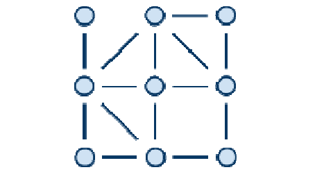
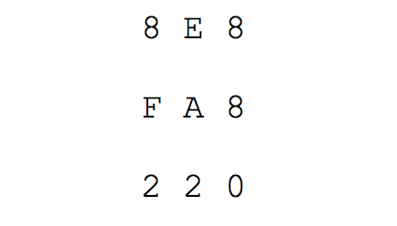

## 문제

Mirko je pronašao hrpu žetona i šibica. Žetone je posložio u pravilnu pravokutnu mrežu od R redova i S stupaca. Za dva žetona kažemo da su susjedni ako se nalaze u istom ili susjednom redu, te u istom ili susjednom stupcu. Dakle, svaki žeton može imati najviše 8 susjednih žetona. Zatim je izmeñu nekih susjednih žetona postavio šibice. Kažemo da su dva žetona povezana ako postoji put koji vodi od prvog do drugog žetona preko jedne ili više šibica. Mirko je šibice postavio tako da je svaki par žetona povezan i da se nijedne dvije šibice meñusobno ne sijeku. Na donjem primjeru vidimo devet žetona i šibice koje ih povezuju.

Kako bi jedinstveno zapisali pozicije šibica, za svaki žeton odredit ćemo 4-bitni broj na sljedeći način:

* Bit težine 1 označava šibicu prema gornjem desnom susjednom žetonu.
* Bit težine 2 označava šibicu prema desnom susjednom žetonu.
* Bit težine 4 označava šibicu prema donjem desnom susjednom žetonu.
* Bit težine 8 označava šibicu prema donjem susjednom žetonu.

Pozicije šibica možemo konačno zapisati kao R×S matricu heksadekadskih znamenaka koje dobijemo pretvaranjem odgovarajućih 4-bitnih brojeva.

Napišite program koji će izračunati na koliko načina Mirko može premjestiti šibicu na neku drugu poziciju tako da je svaki par žetona i dalje povezan te da se šibice i dalje meñusobno ne sijeku.

## 입력

U prvom redu nalaze se dva broja R i S (2 ≤ R, S ≤ 100), broj redova i stupaca pravokutne mreže žetona.

U sljedećih R redova nalazi se po S heksadekadskih znamenki. Znakovi ’0’-’9’ predstavljaju brojeve od 0 do 9, a znakovi ‘A’-’F’ brojeve od 10 do 15.

## 출력

U prvi i jedini red ispišite ukupan broj načina na koji je moguće premjestiti jednu šibicu tako da su žetoni meñusobno povezani, a da se šibice ne sijeku.
