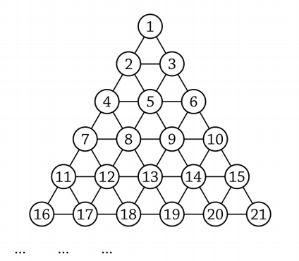

## 문제

Ako poredamo sve prirodne brojeve tako da u prvom redu zapišemo jedan broj, u sljedećem dva te u svakom sljedećem po jedan više, dobit ćemo geometrijsku strukturu kakva je prikazana na slici.

Unutar ove strukture možemo prepoznati pravilne trokute. Pravilan trokut je definiran sa tri broja koji u ovoj strukturi čine vrhove trokuta uz sljedeće uvijete:

1. Stranice tog trokuta su jednake duljine.
2. Stranice tog trokuta su paralelne sa vezama izmeñu brojeva 1, 2 i 3.

Na primjer, brojevi 4, 6 i 13 čine pravilan trokut, dok brojevi 2, 6 i 8 ne čine pravilan trokut jer njegove stranice nisu paralelne sa vezama izmeñu brojeva 1, 2 i 3.

Napišite program koji za zadana dva broja, pronalazi treći broj tako ta tri broja čine pravilan trokut.

## 입력

U prvom i jedinom retku nalaze se dva prirodna broja A i B, 1 <= A,B <= 500 000 000, A ≠ B.

## 출력

U prvom i jedinom retku potrebno je ispisati brojeve meñusobno odvojene razmakom koji označavaju moguće pozicije trećeg vrha.

Ako ima više takvih brojeva, potrebno ih je ispisati poredano od manjeg prema većem.

Ako ne postoji nijedan takav broj, potrebno je ispisati „nema“.
