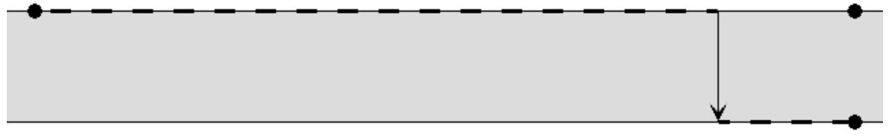
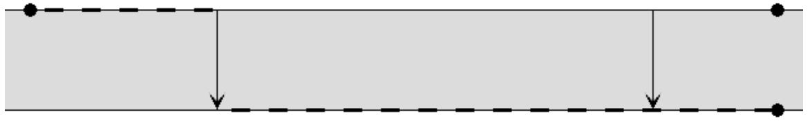
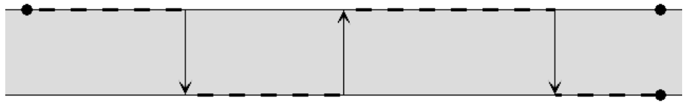

## 문제

Goran živi u malom gradu na velikoj rijeci. Rijeku možemo predstaviti jediničnim pravcem. Goran živi na koordinati 0, a rijeka teče u smjeru rastućih koordinata. Obalu rijeke na kojoj Goran živi označit ćemo slovom A, a onu drugu slovom B.

Baš od sutra na rijeku će početi puštati splavare koji će svojim splavima za jeftine novce prevoziti ljude s jedne strane na drugu, pritom nudeći putnicima fini topli roštilj. Sutra će u pogon pustiti prvu splav, prekosutra drugu, za tri dana treću i tako dalje.

Kako na splavima ne radi nitko osim splavara, oni prevoze putnike samo u jednom smjeru, dok u povratku peku roštilj za novu turu i ne primaju putnike. Kažemo da splavari koji prevoze putnike s obale A na obalu B plove u smjeru 1, dok splavari koji prevoze putnike s obale B na obalu A plove u smjeru 2.

Kako svi njegovi prijatelji navečer trče uz rijeku kako bi održali vitku liniju, Goran je ovdje ugledao sjajnu priliku da se i on dovede u red – trčanje uz ćevape!

On će svaki dan uredno otrčati točno L metara nizvodno uz rijeku, ali neće propustiti priliku da omasti brk toplim ćevapima. Naime, svaki put kada na svom putu naleti na pristanište splavi koja operira prema drugoj strani rijeke, Goran će pričekati splav, zatim se ukrcati te se odmoriti uz porciju ćevapa dok plovi na drugu stranu rijeke, gdje će se iskrcati i krenuti dalje.

Zadane su informacije o splavima redom kojim će se pustiti u pogon. Za svaku splav poznat nam smjer u kojem plovi (smjer 1 ili smjer 2), te udaljenost od Goranove kuće. Napišite program koji će za svaki dan odrediti koliko će metara Goran pretrčati na A obali, koliko na B obali, te koliko porcija ćevapa pojesti.

Slijedi ilustracija prvog primjera:

  
Prvi dan Goran će na obali A pretrčati 500 metara, na obali B 100 metara, te pojesti 1 porciju ćevapa.

  
Drugi dan Goran će na obali A pretrčati 150 metara, na obali B 450 metara, te pojesti 1 porciju ćevapa.

  
Treći dan Goran će na obali A pretrčati 350 metara, na obali B 250 metara, te pojesti 3 porcije ćevapa.

## 입력

U prvom retku nalaze se dva prirodna broja N i L (1 ≤ N ≤ 100 000, N < L < 109 ), broj dana i udaljenost koju Goran svaki dan mora pretrčati.

U svakom od sljedećih N redaka nalazi se opis splavi koja je počela ploviti taj dan. Opis splavi se sastoji od dva prirodna broja S i D (1 ≤ S ≤ 2, 0 < D < L), smjer u kojem splav plovi i udaljenost od Goranove kuće.

Nijedan par splavara neće ploviti na istoj udaljenosti od Goranove kuće.

## 출력

Za svaki od N dana potrebno je ispisati po tri cijela broja u zaseban redak, broj pretrčanih metara na obali A, broj pretrčanih metara na obali B, te broj pojedenih porcija ćevapa taj dan.
