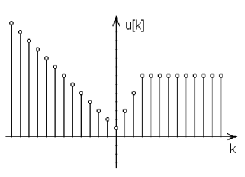
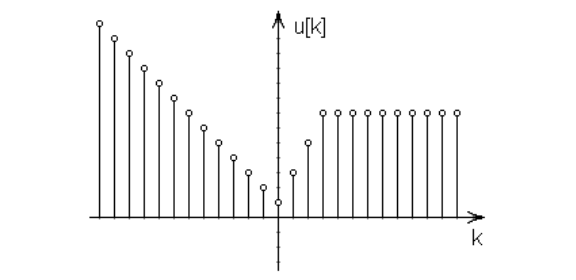
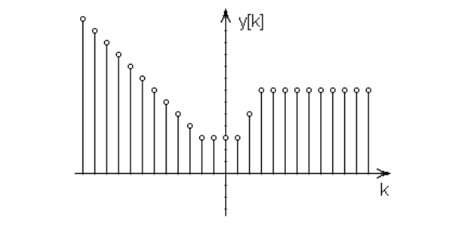
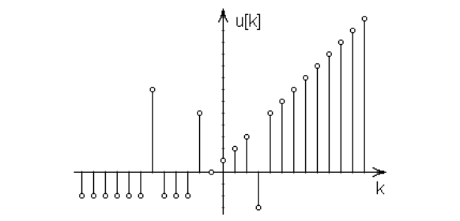
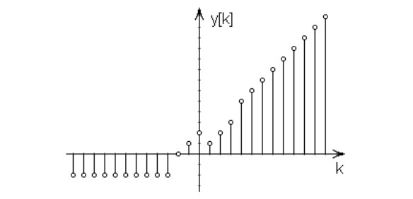

## 문제

Digitalni signal možemo zamisliti kao funkciju koja svakom cijelum broju k pridružuje cijeli broj u[k]. Kako bi (beskonačne) signale predstavili uz pomoć konačno mnogo brojeva, koristimo se interpolacijom. Naime, neke vrijednosti ćemo eksplicitno zadati, dok ćemo ostale vrijednosti izračunati linearnom interpolacijom.

Na primjer, signal na gornjoj slici možemo predstaviti točkama (−2, 3), (0, 1), (3, 7) i (5, 7), odnosno poznato nam je samo u[−2] = 3, u[0] = 1, u[3] = 7 i u[5] = 7. Ostale vrijednosti dobivamo provlačenjem pravaca kroz susjedne točke. Tako na primjer:

* Vrijednosti na intervalu <−∞, 0] izračunavamo pomoću pravca koji prolazi točkama (−2, 3) i (0, 1).
* Vrijednosti na intervalu [0, 3] izračunavamo pomoću pravca koji prolazi točkama (0, 1) i (3, 7).
* Vrijednosti na intervalu [3, ∞> izračunavamo pomoću pravca koji prolazi točkama (3, 7) i (5, 7).

Primijetimo da isti signal možemo opisati sa proizvoljno mnogo točaka, sve dok pravci koji prolaze susjednim točkama točno interpoliraju signal.

Za uklanjanje šuma u signalima često se koriste median filtri. Median filtar širine 2·d+1 sustav je koji na ulaz prima signal u[k], a na izlaz daje signal y[k] = median{ u[k-i]; –d ≤ i ≤ d }.

Drugim riječima, y[k] dobivamo tako da sortiramo vrijednosti u[k-d], u[k-d+1], ..., u[k+d] te u sortiranom nizu odaberemo vrijednost u sredini niza.

Slike na lijevoj strani prikazuju ulazni signal, dok slike na desnoj strani odgovarajući izlazni signal za širinu filtra jednaku 5.

  

Napišite program koji će izračunati izlazni signal iz median filtra širine 2·d+1 ako je ulazni signal zadan točkama. Na izlaz je dozvoljeno ispisati proizvoljan broj točaka, sve dok je on manji od 100 000 i dok točke ispravno interpoliraju izlazni signal.

## 입력

U prvom retku nalazi se prirodan broj N (2 ≤ N ≤ 50), broj točaka koje opisuju ulazni digitalni signal.

U sljedećih N redaka nalaze se po dva cijela broja po apsolutnoj vrijednosti manja ili jednaka od 109 , koordinate točaka. Točke će biti zadane strogo uzlazno prema prvoj koordinati. Sve interpolirane vrijednosti bit će cjelobrojne.

U zadnjem retku nalazi se prirodni broj d (0 ≤ d ≤ 50), gdje je 2·d+1 širina median filtra.

## 출력

U prvi redak potrebno je ispisati prirodan broj M (2 ≤ M ≤ 100 000), broj točaka koje opisuju izlazni signal.

U sljedećih M redaka treba ispisati po dva cijela broja, koordinate točaka. Ispisani brojevi moraju stati u 64-bitni cjelobrojni tip podataka s predznakom. Točke moraju biti poredane strogo uzlazno prema prvoj koordinati.

Rješenje nije jedinstveno.
