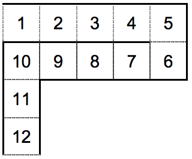

## 문제

Mirko i Slavko su slobodan dan odlučili posvetiti posjetu lunaparku. Najveća atrakcija u lunaparku je vodeni tobogan. Nažalost, red u kojem se čeka na ulaz u vodeni tobogan je uvijek pun.

Sljedeća slika prikazuje primjer tlocrta reda u kojem se čeka 12 minuta. Početak reda je u polju 1.

Mirko je ušao u red; sva mjesta ispred njega su puna. Nakon jedne minute, osoba na kraju reda ulazi na tobogan, svi u redu se pomiču unaprijed jedno mjesto i nova osoba ulazi u red.

Slavko se prije ulaska u red zaletio do štanda s vrućim hrenovkama. Točno K minuta nakon Mirka, Slavko uspijeva ući u red.

Mirko i Slavko mogu čavrljati ako se nalaze na poljima susjednima u nekom od osam smjerova (gore, dolje, lijevo, desno te četiri dijagonalna smjera). Koliko minuta će provesti u čavrljanju?

U gornjem primjeru, ako Slavko uñe u red dvije minute nakon Mirka, moći će čavrljati ukupno tri minute dok čekaju u redu:

* dok je Mirko u polju 6, a Slavko u polju 4;
* dok je Mirko u polju 7, a Slavko u polju 5;
* dok je Mirko u polju 11, a Slavko u polju 9.

## 입력

Prvi red sadrži duljinu reda L (2 ≤ L ≤ 250) i opis tlocrta reda, niz od L−1 velikih slova. Niz opisuje put koji prijeñe svaki gost parka koji čeka u redu. Pojavljivat će se slova 'L', 'R', 'U' i 'D', a označavaju pomicanje na polje lijevo, desno, gore i dolje od trenutnog.

Drugi red sadrži prirodni broj K (1 ≤ K < L), koliko minuta nakon Mirka je Slavko ušao u red.

Niz slova u prvom redu ulaza će predstavljati valjani tlocrt reda, tj. red neće sjeći sam sebe.

## 출력

Ispišite koliko minuta će Mirko i Slavko biti dovoljno blizu da čavrljaju.
