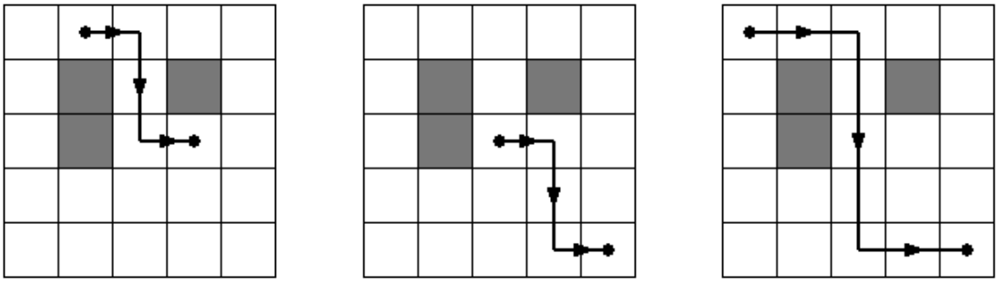

## 문제

Mali Luka svaki dan pješači u školu, uvijek istim putem i to tako da:

* najprije preñe točno četvrtinu puta hodajući ravno prema istoku,
* zatim preñe polovinu ukupnog puta hodajući ravno prema jugu,
* te preñe preostalu četvrtinu puta hodajući ponovno ravno prema istoku.

Lukino selo predstavljeno je pravilnom N×N kvadratnom mrežom. Neki kvadrati prepuni su bodljikavog grmlja, pa su potpuno neprohodni, dok je na preostalim kvadratima fina travnata površina, po kojoj Luka može slobodno gaziti. Na ilustracijama dolje, sivi su kvadrati neprohodni, dok su bijeli prohodni.

Luka, na svojem putu, nikada ne hoda po rubu izmeñu dva kvadrata.

U centru jednog, nama nepoznatog, travnatog kvadrata nalazi se Lukina kuća, dok se u centru jednog drugog, takoñer nepoznatog, travnatog kvadrata nalazi škola.

  
Ilustracije prikazuju rješenje prvog primjera. Postoji ukupno tri moguća para pozicija Lukine kuće i škole.

Napišite program koji će za zadanu kvadratnu mrežu odrediti ukupan broj parova pozicija na kojima se mogu nalaziti Lukina kuća i škola.

## 입력

U prvom retku nalazi se prirodan broj N (1 ≤ N ≤ 2000), dimenzije kvadratne mreže.

U svakom od sljedećih N redaka nalazi se po N znakova: '.' (točka) ili malo slovo 'x'. Točkom su predstavljeni travnati kvadrati, dok su malim slovom 'x' predstavljeni neprohodni kvadrati.

Kvadratna mreža poklapa se sa zemljinim osima i to tako da su kvadrati u prvom retku najsjeverniji, a kvadrati u prvom stupcu najzapadniji.

## 출력

U prvi redak potrebno je ispisati ukupan broj parova pozicija na kojima se mogu nalaziti Lukina kuća i škola.
