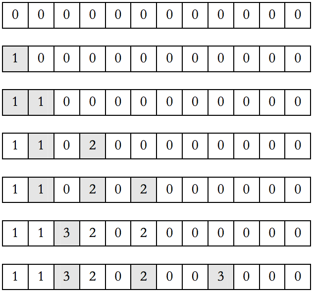

## 문제

Na jednom jezeru nalazi se beskonačan niz lopoča, pravilno poredanih jedan do drugog u ravnoj liniji, na kojima se svakodnevno odmaraju žabe. Svako jutro žabe se poredaju po lopočima prema sljedećim pravilima:

* Postoji N tipova žaba, tipovi su označeni redom brojevima od 1 do N, te je, za svaki tip, poznato koliko ukupno žaba tog tipa obitava na jezeru.
* Žaba tipa d uvijek skače udaljenost u iznosu od d lopoča, a svaka žaba skače sve dok ne stigne do lopoča na kojem nema druge žabe, te se tamo zadrži do kraja dana.
* Na jezeru žabe dolaze jedna po jedna, te skaču po gornjim pravilima dok se ne smjeste na lopoč. Najprije na red dolaze sve žabe tipa 1, zatim sve žabe tipa 2, i tako dalje do žaba tipa N.

Slijedi ilustracija prvog primjera. Ukupno postoji tri tipa žaba, a na jezeru obitavaju po dvije žabe svakog tipa.

Nule predstavljaju prazne lopoče, a ostali brojevi tip žabe koja se zadržala na lopoču. Osjenčani su lopoči po kojima je zadnja žaba skakala dok se nije smjestila na svoj lopoč.

Zadnja žaba tipa 1 nalazi se na poziciji 2, žaba tipa 2 na poziciji 6, a zadnja žaba tipa 3 na poziciji 9.

Napišite program koji će za svaki tip žabe odrediti poziciju najdaljeg lopoča na kojem se nalazi žaba tog tipa.

## 입력

U prvom retku nalazi se prirodan broj N (1 ≤ N ≤ 10), broj tipova žaba.

U svakom od sljedećih N redaka nalazi se po jedan prirodan broj manji ili jednak od 50 000 000, broj žaba odgovarajućeg tipa, redom od tipa 1 do tipa N.

## 출력

U N redaka treba ispisati po jedan prirodan broj, poziciju najdaljeg lopoča na kojem se nalazi žaba odreñenog tipa, redom od tipa 1 do tipa N.
