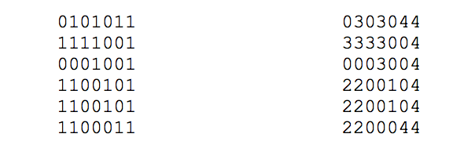

## 문제

Zoran živi na farmi te ima najveći kombajn u selu. Ove je godine, unatoč problemima s otkupom, Zoran posadio nekoliko polja pšenice. Došlo je vrijeme žetve, a njemu se sad baš i ne da raditi.

Ipak, svaki će dan požnjat jedno polje pšenice i to ono najmanje kvadrature.

Njegovo zemljište možemo predstaviti R×S kvadratnom mrežom. Za svaki kvadrat poznato je da li je Zoran tamo posijao pšenicu ili nije. Za dva kvadrata zemljišta kažemo da su susjedni ako imaju zajedničku stranicu.

Jednim poljem pšenice nazivamo maksimalan skup susjednih kvadrata na kojima je posijana pšenica. U lijevoj tablici prepoznajemo tako četiri polja. U desnoj tablici polja su označena redom kojim će ih Zoran žnjeti.

Napišite program koji će za svaki kvadrat na kojem je posijana pšenica odrediti na koji će dan Zoran proći svojim kombajnom i požnjeti pšenicu.

## 입력

U prvom retku nalaze se prirodni brojevi R i S (1 ≤ R, S ≤ 50), dimenzije Zoranovog zemljišta.

U sljedećih R redaka nalazi se po S znakova '0' ili '1'. Znak '0' predstavlja kvadrat zemljišta na kojem nije posijana pšenica, a znak '1' kvadrat zemljišta na kojem je posijana pšenica.

Broj polja pšenice bit će manji od 10, a nijedna dva polja pšenice neće imati jednaku kvadraturu.

## 출력

U R redaka potrebno je ispisati po S znakova. Na kvadratima koji ne sadrže pšenicu mora stajati znak '0', dok na preostalim kvadratima mora stajati redni broj dana kad će taj kvadrat biti požnjen.
