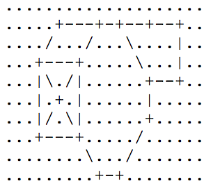
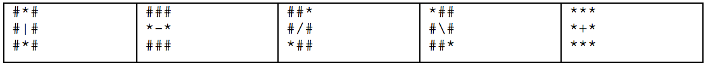

## 문제

Cestovni sustav nekog grada, gledan iz zraka, izgleda kao polje od R x S jediničnih kvadratića. Svaki jedinični kvadratić može biti ili prazan ili se u njemu može nalaziti jedinični dio neke ceste. Jedinični dio ceste može biti vertikalan, dijagonalan, horizontalan ili pak raskrižje. Na donjoj slici je prikazan jedan takav cestovni sustav:

U polju, dakle, postoji 6 dozvoljenih znakova: znak '.' (točka) predstavlja prazni jedinični kvadratić kroz kojeg ne prolazi cesta. Znak '-' (minus) predstavlja horizontalnu jediničnu cestu, znakovi '/' i '\' predstavljaju dijagonalne jedinične ceste, dok znak '|' („pipe“) predstavlja vertikalnu jediničnu cestu. Znak '+' koji predstavlja raskrižje.

U sljedećoj tablici je precizno opisano sa kojih od susjednih 8 jediničnih kvadratića automobil može ući na pojedinu jediničnu cestu, odnosno izaći sa nje:

Znakom '#' označili smo jedinične kvadratiće sa kojih se ne može ući na središnju jediničnu cestu. To su ujedno i kvadratići na koje se ne može izaći iz središnje jedinične ceste. Znakom '\*' označili smo one jedinične kvadratiće sa kojih je to moguće.

Siguran cestovni sustav mora poštovati odreñena pravila: u njemu ne smije postojati slijepa ulica, odnosno jedinična cesta koja je spojena na manje od dvije susjedne jedinične ceste. Za dvije jedinične ceste kažemo da su spojene ukoliko se može doći (gledajući gornju tablicu) sa prve na drugu te sa druge na prvu. Cestovni sustav na gornjoj slici je siguran.

Naš prijatelj Ljubo je opet počeo raditi nepodopštine: ove godine je bespravno sagradio nekoliko cesta. Zbog takve gradnje, cestovni sustav možda više nije siguran. Vaš je zadatak učiniti sustav ponovno sigurnim za promet uništitavajući što je moguće manje jediničnih cesta. Uništenje jedne jedinične ceste podrazumijeva pretvaranje odgovarajućeg znaka u '.' (točku).

## 입력

U prvom redu nalaze se brojevi R i S, 1 ≤ R ≤ 20, 1 ≤ S ≤ 20, broj redaka i stupaca cestovnog sustava.

U svakom od sljedećih R redaka nalazi po S znakova koji predstavljaju sustav na način opisan u tekstu. Pri tome će se javljati samo 6 gorenavedenih znakova.

## 출력

U R redaka treba ispisati S znakova, koji predstavljaju popravljeni cestovni sustav tako da on bude siguran. Na originalnom cestovnom sustavu ne smijete raditi nikakve promjene osim pretvaranja neke jedinične ceste u znak '.' (točku).

Napomena: Može se pokazati da će siguran cestovni sustav sa najmanjim mogućim brojem uništenih cesta biti jedinstven.
