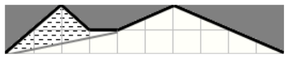

## 문제

Ljubo je lokalni moćnik malog primorskog mjesta i njegova je odgovornost brinuti za razvoj turizma. Naravno, Ljubo je svjestan da ništa ne privlači turiste više od šetnje prekrasnom betoniranom rivom, pa je stoga odlučio ograditi dio obale kako bi ga mogao zaliti betonom. Kako bi turisti što više uživali, Ljubo želi betonirati dio obale što je moguće veće površine.

Obalna crta je zadana izlomljenom linijom koja ne presjeca samu sebe; linija je opisana nizom vrhova (x1 , y1 ), (x2 , y2 ), ..., (xN, yN), te uvijek ide sa lijeva na desno, točnije vrijedi x1 < x2 < ... < xN. More se nalazi iznad, a obala ispod izlomljene linije.

Ljubi je na raspolaganju špaga dugačka L metara. On će odabrati dva vrha izlomljene linije i u njih zabiti dva štapa. Potom će razapeti špagu (ili samo dio špage) izmeñu ta dva štapa tako da špaga bude napeta. Dužina koju razapinje špaga ne smije sjeći more, ali je dopušteno da dodiruje obalnu liniju. Nakon što razapne špagu, Ljubo će betonirati dio obale izmeñu špage i mora.

Slika odgovara trećem primjeru. Crna izlomljena linija predstavlja obalnu crtu, more je zasivljeno. Razapeta Ljubina špaga je predstavljena sivom dužinom. Betonirani dio obale je osjenčan.

Napišite program koji, na temelju obalne linije i duljine špage, odreñuje kolika je maksimalna površina obale koju Ljubo može ograditi i zatim izbetonirati. Primjetite da tražena površina može biti i nula.

## 입력

U prvom redu ulaza nalaze se cijeli brojevi N i L, 3 ≤ N ≤ 5 000, 0 ≤ L ≤ 1 000 000. Broj N predstavlja broj vrhova izlomljene linije kojom je opisana obalna crta. Broj L predstavlja duljinu Ljubine špage.

U svakom od idućih N redova nalaze se po dva cijela broja xi i yi odvojena razmakom, 0 ≤ xi , yi ≤ 1 000 000 — koordinate vrhova obalne linije.

## 출력

U jedinom redu izlaza treba ispisati jedan realni broj – najveću moguću površinu obale koju Ljubo može ograditi i betonirati.

Rješenje je potrebno ispisati sa točno jednom decimalnom znamenkom. Možete pretpostaviti da će površina uvijek biti ili cijeli broj ili polovina cijelog broja.
