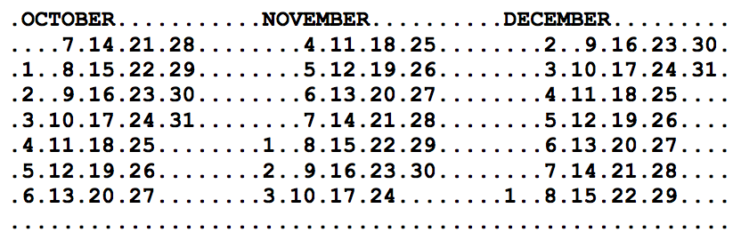

## 문제

Kalendar neke nepoznate godine je zapisan u velikoj matrici znakova. Svaki element matrice je ili veliko slovo engleske abecede ili znamenka ili točka. Kalendar je napravljen na sljedeći način:

* Svaki mjesec se nalazi u matrici s točno 8 redaka i 17 stupaca.
  + Ime mjeseca (na engleskom jeziku, velikim slovima) je zapisano u prvom retku počevši od drugog stupca.
  + Svi dani u mjesecu su zapisani u 6 grupa po dva stupca visine 7 redaka, izmeñu susjednih grupa se nalazi jedan prazan stupac (odnosno popunjen točkama).
  + Svaka grupa sadrži uzastopne brojeve dana u jednom tjednu.
  + Broj se sastoji od jedne ili dvije znamenke, ako je broj jednoznamenkast onda se nalazi se u desnom stupcu.
    - Prvi redak odgovara ponedjeljku.
    - Prva grupa stupaca mora sadržavati barem jedan broj dok peta i šesta grupa stupaca mogu biti prazne (na primjer ako mjesec sadrži 28 dana i počinje ponedjeljkom).
* Mjeseci godine su podjeljeni u tri reda, odvojenih jedim praznim retkom. U svakom retku se nalaze četiri uzastopna mjeseca odvojena jednim praznim stupcem.
* Na sva četiri ruba kalendara se nalazi prazna margina od jednog retka odnosno stupca.

Dakle cijeli kalendar se sastoji od točno 28 redaka i 73 stupca. Gornja slika prikazuje donji desni rub kalendara za 2002. godinu.

Arheolozi su pronašli djelić pravokutnog oblika koji je izrezan iz jednog takvog kalendara, takoñer znaju da taj fragment nije rotiran niti na bilo koji drugi način izmjenjen. Napišite program koji će odrediti sve moguće godine izmeñu 1900 i 2100 uključivo iz kojeg je mogao biti izrezan taj fragment.

Engleska imena mjeseci su redom: JANUARY, FEBRUARY, MARCH, APRIL, MAY, JUNE, JULY, AUGUST, SEPTEMBER, OCTOBER, NOVEMBER, DECEMBER.

Godina je prijestupna ako je djeljiva sa 400, ili ako je djeljiva sa 4 i nije djeljiva sa 100. Prvi siječanj 1900-te godine je bio ponedjeljak.

## 입력

U prvom retku nalaze se dva prirodna broja N i M (2 ≤ N, M ≤ 10) – broj redaka i stupaca u zadanom fragmentu. U svakom od sljedećih N redova nalazi se po M znakova – jedan redak fragmenta.

## 출력

Potrebno je ispisati, uzlaznim redosljedom, sve tražene godine, svaku u svoj redak.

Test podaci će biti takvi da će uvijek postojati barem jedno rješenje.
