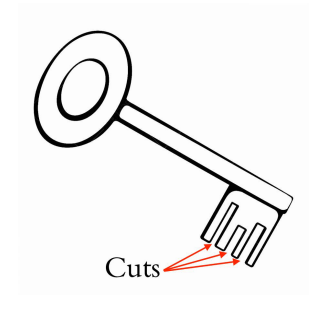

## 문제

Hassan is a happy key maker. Every customer arrives with a safe-box key, and asks him to create some copies of the key. Each key has several cuts of different depths. The picture below shows a safe-box key with 3 cuts. To make a copy, Hassan needs to make the same number of cuts with exactly the same sequence of depths in a new blank key.

In the first days of his job, Hassan wasted many blank keys to make copies. Most of the copied keys, however, did not match the customer keys and he could not sell them. He collected those copied keys in a trash-box, and now he is thinking of recycling them.

When a new customer arrives, Hassan looks into the trash-box, collects all keys with the same number of cuts as the customer’s key, and counts the keys that can match the customer’s key. A key can match the customer’s key if it already has exactly the same sequence of cut depths, or the depth of some of its cuts can be increased to reach the same sequence. Since this job is too hard for him, he has asked your help. For simplicity, you can assume that in any two keys with the same number of cuts, the position of the cuts along the keys are identical.

## 입력

There are multiple test cases in the input. The first line of each test case contains two space-separated integers m as the number of cuts in the customer’s key (1 ≤ m ≤ 10), and n as the number of keys with the same number of cuts in the trash-box (1 ≤ n ≤ 100). The second line of the test case consists of m space-separated integers, as the depths of cuts in the customer’s key. Each of the next n lines also contains m integers, as the depths of cuts in a trash-box key. The depth of cuts in each of these n + 1 keys are 1-digit positive integers given in the left-to-right order. The input terminates with a line containing 0 0 which should not be processed.

## 출력

For each test case, print a single line containing the number of keys in the trash-box that either match the customer’s key or can be cut to match it.
