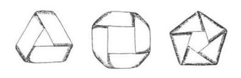

## 문제

A Möbius strip is obtained by taking a long strip of paper, twisting the paper through 180 degrees (or in other words, a half-twist) and then, joining one end back to the other end of the strip. A möbius strip is shown in the figure to the right.

Instead of performing only one half-twist, we can also do zero, two, three, four, or more half-twists, and then tape the two ends. The resulting shape for three, four, and five half-twists respectively looks like below:

The “type” of each strip is a non-negative integer denoting the number of its halftwists. Now given a strip, consider a line along the length of the strip that lies one-third of the width away from one edge of the strip. Next, cut the strip along that line using scissors as shown in the figure to the right. The cutting is continued until it reaches its starting point.

After we cut the strip as above, we get a number of strips each with some number of half-twists. For example, if we begin with a strip of type 2, we get two strips of type 2. We are allowed to cut again and again some of the resulting strips if we wish. Some of the resulting strips may be intertwined. In that case, we consider them as two distinct strips and can cut each of the strips independently and separately from the other strip(s).

Now here is the question: Given two sets of strips, can we cut some strips in the two sets such that the two sets of strips are transformed into two new sets of strips with equal number of strips of each type?

## 입력

There are multiple test cases in the input. The first line of each test case contains two space-separated integers a and b (1 ≤ a, b ≤ 100), as the number of strips in each of the two sets of strips. The following two lines contain a and b non-negative integers respectively, as the types of strips in each set. All the given strip types are at most 100. The input terminates with a line containing -1 -1 which should not be processed.

## 출력

For each test case, on a separate line, write either the character “Y” denoting that we can make the required transformation or the character “N” denoting otherwise.
