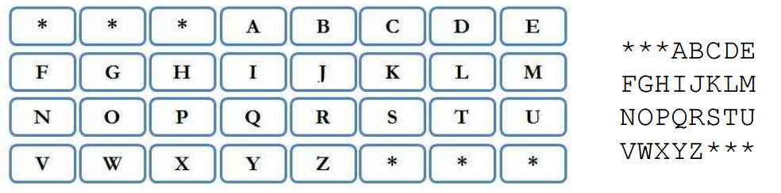

## 문제

A ticket machine is a device similar to an ATM and was introduced by Croatian Railways in order to make purchasing train tickets easier. The first step in buying a ticket is choosing the destination​ of your journey. The destination can be one of N destinations offered in advance, names of local and worldwide places. You choose your destination by typing its name letter by letter. By entering each additional letter, the number of possible destinations reduces.

The initial appearance of the keyboard on the screen is shown in the picture. We will represent it as four arrays of characters of length 8.

After choosing each letter, the keyboard changes its appearance. Only letters that can be chosen in the next step are left active (depending on the destinations still possible to choose). The remaining letter that can’t be chosen are replaced with the character “\*”.

Write a programme that will, for N given destinations and the first few letters (not all of them) of the chosen destination, output the appearance of the keyboard before entering the next letter. You will never be given the entire word.

## 입력

The first line contains the integer N (1 ≤ N ≤ 50) from the task. Each of the following N lines contains one string of at most 100 characters that contains only uppercase letters of the English alphabet. The last line contains the string that represents the first few letters of the chosen destination.

## 출력

You must output the appearance of the keyboard described in the task.

## 힌트

Clarification of the example : After entering the letters “ZA”, the third letter can be “G” if we want a ticket to Zagreb, “D” if we want a ticket to Zadar, and “B” if we want a ticket to Zabok.
