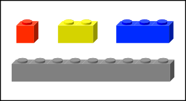
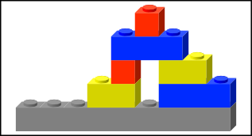
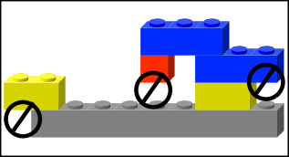
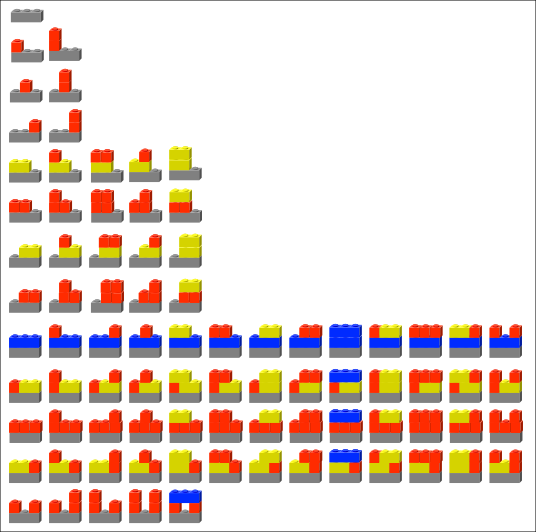

## 문제

영선이는 크기가 1×1×1, 1×1×2, 1×1×3인 블록을 가지고 있다. 또, 크기가 1×1×w인 블록을 가지고 있는데, 이 블록은 기초 블록이라고 한다.

영선이는 블록과 기초 블록을 이용해서 구조를 만들려고 한다. 모든 블록은 기초 블록과 연결되어 있어야 한다. 정수가 아닌 위치에는 블록을 놓을 수 없다. 긴 블록 (1×1×2, 1×1×3)의 경우에는 블록의 양 끝이 다른 블록의 위에 있어야 한다. 1×1×3 블록의 경우에 가운데 칸의 아래는 비어 있어도 된다.

왼쪽 그림은 올바른 구조이고, 오른쪽 그림은 만들 수 없는 구조이다.

구조의 높이는 블록을 쌓은 층의 개수이다. 기초 블록의 높이 w와 h가 주어졌을 대, 블록(개수는 무한대)과 기초 블록 하나를 가지고 만들 수 있는 구조 중, 높이가 h를 넘지 않는 것의 개수를 구하는 프로그램을 작성하시오.

아래 그림은 w = 3, h = 2인 경우 모든 84가지 구조이다.

## 입력

첫째 줄에 w와 h (1 ≤ w, h ≤ 10)가 주어진다.

## 출력

첫째 줄에 문제의 정답을 1000000007로 나눈 나머지를 출력한다.
