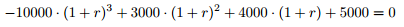

## 문제

Jane plans to open a flower shop in the local flower market. The initial cost includes the booth license, furnishings and decorations, a truck to transport flowers from the greenhouse to the shop, and so on. Jane will have to recoup these costs by earning income. She has estimated how much net income she will earn in each of the following Mmonths.

Jane wants to predict how successful her flower shop will be by calculating the IRR (Internal Rate of Return) for the M-month period. Given a series of (time, cash flow) pairs (i, Ci), the IRR is the compound interest rate that would make total cash exactly 0 at the end of the last month. The higher the IRR is, the more successful the business is. If the IRR is lower than the inflation rate, it would be wise not to start the business in the first place.

For example, suppose the initial cost is \$10,000 and the shop runs for 3 months, with net incomes of \$3,000, \$4,000, and \$5,000, respectively. Then the IRR r is given by:

In this case, there is only one rate (~=8.8963%) that satisfies the equation.

Help Jane to calculate the IRR for her business. It is guaranteed that -1 < r < 1, and there is exactly one solution in each test case.

## 입력

The first line of the input gives the number of test cases, T. T test cases follow. Each test case starts with a positive integer M: the number of months that the flower shop will be open. The next line contains M + 1 non-negative integers Ci (0 ≤ i ≤ M). Note that C0represents the initial cost, all the remaining Cis are profits, the shop will always either make a positive net profit or zero net profit in each month, and will never have negative profits.

Limits

* 1 ≤ T ≤ 100.
* C0 > 0.
* 0 ≤ Ci ≤ 1,000,000,000.
* 1 ≤ M ≤ 2.

## 출력

For each test case, output one line containing `Case #x: y`, where `x` is the test case number (starting from 1) and `y` is a floating-point number: the IRR of Jane's business. `y`will be considered correct if it is within an absolute  or relative error of 10-9 of the correct answer.

## 힌트

In sample case #1, the IRR is 0, Jane just paid back all the money and no interest.  
  
Sample case #2 and #3 would only appear in Large dataset.
