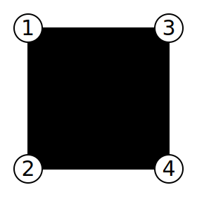
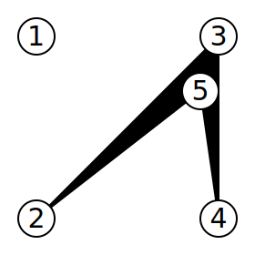
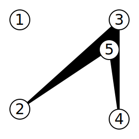

## 문제

The artist Cody-Jamal recently decided to out-hip all of his hipster friends by showing his latest paintings in an impromptu outdoor gallery. He is going to show up in a field, put up some paintings, and display them.

The field has **N** posts in it, with no subset of 3 of them being collinear (which also implies that no two posts are in the same place). Cody-Jamal is going to choose four of them — call them p1, p2, p3, and p4. He will then string velvet ropes between p1 and p2, p2 and p3, p3 and p4, and finally, p4 and p1. He must choose the four ordered posts such that no two ropes cross, effectively forming a [simple quadrilateral](./001_Quadrilateral) p1p2p3p4. The quadrilateral may be convex or concave. He will then hang his paintings inside the perimeter delimited by the ropes.

To attract wealthy art lovers that might purchase his paintings, Cody-Jamal is hiring waitstaff to go around and serve refreshments to visitors. The cost of the refreshments is fixed, but the cost of the waitstaff is proportional to the area they will have to walk. Specifically, they charge 2 artcoins per square meter. Therefore, Cody-Jamal wants to choose p1, p2, p3 and p4 to minimize the area of the quadrilateral p1p2p3p4, and thus minimize the cost (in artcoins) of the refreshments service. What is the minimum such cost?

## 입력

The first line of the input gives the number of test cases, **T**. **T** test cases follow. Each test case begins with a line containing a single integer **N**: the number of posts in the field. **N** more lines follow, each containing two integers **Xi** and **Yi**, representing the coordinates, in meters from an arbitrary origin, of the i-th post.

## 출력

For each test case, output one line containing `Case #x: y`, where `x` is the test case number (starting from 1) and `y` is the minimum number of artcoins Cody-Jamal will have to pay — or, in other words, twice the area (in square meters) of a smallest simple quadrilateral that has four of the input points as vertices.

## 힌트

In Case #1, there are only 4 points in the input, and the only orderings that can be chosen to form a simple quadrilateral yield a square of side length 10.

In Cases #2 and #3, an optimal choice is to leave the first point out and use the last four, in the order given in the input.

