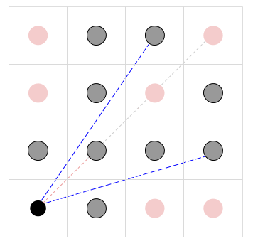
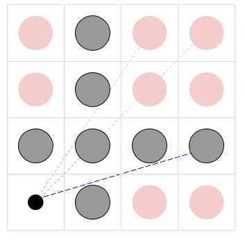

## 문제

Your friend Cody-Jamal is working on his new artistic installment called "Gallery of Pillars". The installment is to be exhibited in a square gallery of N by N meters. The gallery is divided into N2 squares of 1 by 1 meter, forming an N by N matrix. The exact center of the southwest corner cell is called the viewpoint; a person viewing the artwork is supposed to stand there. Each other cell contains a cylindrical pillar. All pillars have two circular bases of radius R: one resting on the floor, in the center of its corresponding cell, and the other touching the gallery's ceiling. The observer will stand in the viewpoint, observe the N2 - 1 pillars, and marvel.

Cody-Jamal is currently scouting venues trying to see how large he can make the value of N. Also, he has not decided which material the pillars will be made of; it could be concrete, or carbon nanotubes, so the radius R of the base of each pillar could vary from 1 micrometer to almost half a meter. Notice that a radius of half a meter would make neighboring pillars touch.

You, as a trained mathematician, quickly observe that there could be pillars impossible to see from the viewpoint. Cody-Jamal asks your help in determining, for different combinations of N and R, the number of visible pillars. Formally, a pillar is visible if and only if there is a straight line segment that runs from the center of the southwest corner cell (the viewpoint) to any point on the pillar's boundary, and does not touch or intersect any other pillar.

## 입력

The first line of the input gives the number of test cases, T. T lines follow. Each line describes a different test case with two integers N and R. N is the number of 1 meter square cells along either dimension of the gallery, and R is the radius of each pillar, in micrometers. Thus, R / 106 is the radius of each pillar in meters.

### Limits

* 1 ≤ T ≤ 100.
* 1 ≤ R < 106 / 2.
* 2 ≤ N ≤ 109.

## 출력

For each test case, output one line containing `Case #x: y`, where `x` is the test case number (starting from 1) and `y` is the number of pillars in the installment that are visible from the viewpoint.

## 힌트

The pictures below illustrate the first two samples (not to scale). In the center of the black circle is the observer. The other circles are pillars, with the visible ones in gray and the not visible ones in red. The blue dotted lines represent some of the unblocked lines of sight; the red dotted lines represent blocked lines of sight (that turn gray at the point at which they are first blocked).

