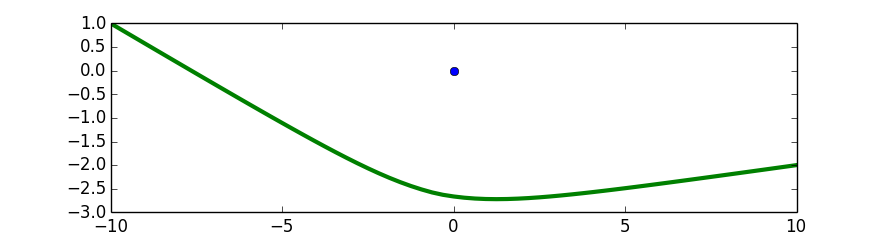

## 문제

You are steering a boat from the coordinates (-10, **A**) to the coordinates (10, **B**). The coordinates are measured in kilometers, and your boat travels at a constant speed of 1 kilometer per hour. You have full control over the path the boat takes. We model the boat as a single point.

There are **N** islands in the area; we model them as single points. The i-th island is at the coordinates (0, **Ci**).

The area is radioactive, and you constantly receive 1 microsievert per hour of radiation from the general environment, no matter where you are. Moreover, the islands themselves are radioactive, and you constantly receive additional radiation at a rate of (Di)-2microsieverts per hour from the i-th island, where Di is your current distance (in kilometers) from the i-th island. (Formally: let Di(t) be your distance from the i-th island as a function of time t, and X be the total time your journey takes. Then the total radiation received from the i-th island is the definite integral from 0 to X of Di(t)-2.) You can get as close to an island as you would like, as long as you do not match its exact coordinates.

Find the minimum total radiation dose that you can receive if you plot your course optimally.

## 입력

The first line of the input gives the number of test cases, **T**; **T** test cases follow. Each test cases consists of two lines. The first line of a test case consists of three values: an integer **N**, and two floating-point numbers **A** and **B**, as described in the statement above. The second line of a test case consists of **N** floating-point numbers **Ci**; the i-th of these numbers gives the y coordinate of the i-th island.

All floating-point numbers are specified to exactly two decimal places.

### Limits

* -10.00 ≤ **A** ≤ 10.00.
* -10.00 ≤ **B** ≤ 10.00.
* -10.00 ≤ **Ci** ≤ 10.00, for all i.
* **Ci** ≠ **Cj**, for all i ≠ j.
* 1 ≤ **T** ≤ 50;
* 1 ≤ **N** ≤ 2.

## 출력

For each test case, output one line containing `Case #x: y`, where `x` is the test case number (starting from 1) and `y` is the minimum radiation dose (in microsieverts) received while completing the journey.

`y` will be considered correct if it is within an absolute or relative error of 10-3 of the correct answer. See the [FAQ](https://code.google.com/codejam/faq.html#5-9) for an explanation of what that means, and what formats of real numbers we accept.

## 힌트

Here is a diagram of the optimal path for sample case #1. We have enlarged the island to make it more visible, but remember to treat it as a single point.

