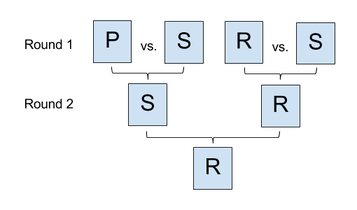

## 문제

You've been asked to organize a Rock-Paper-Scissors tournament. The tournament will have a single-elimination format and will run for N rounds; 2N players will participate.

Initially, the players will be lined up from left to right in some order that you specify. In each round, the first and second players in the lineup (starting from the left) will play a match against each other, and the third and fourth players in the lineup (if they exist) will play a match against each other, and so on; all of these matches will occur simultaneously. The winners of these matches will remain in the lineup, in the same relative order, and the losers will leave the lineup and go home. Then a new round will begin. This will continue until only one player remains in the lineup; that player will be declared the winner.

In each Rock-Paper-Scissors match, each of the two players secretly chooses one of Rock, Paper, or Scissors, and then they compare their choices. Rock beats Scissors, Scissors beats Paper, and Paper beats Rock. If one player's choice beats the other players's choice, then that player wins and the match is over. However, if the players make the same choice, then it is a tie, and they must choose again and keep playing until there is a winner.

You know that the players this year are stubborn and not very strategic. Each one has a preferred move and will only play that move in every match, regardless of what the opponent does. Because of this, if two players with the same move go up against each other, they will keep tying and their match will go on forever! If this happens, the tournament will never end and you will be a laughingstock.

This year, there are R players who prefer Rock, P players who prefer Paper, and S players who prefer Scissors. Knowing this, you want to create a lineup that guarantees that the tournament will go to completion and produce a single winner — that is, no match will ever be a tie. Your boss has asked you to produce a list of all such lineups (written in left to right order, with `R`, `P`, and `S` standing for players who prefer Rock, Paper, and Scissors, respectively), and then put that list in alphabetical order.

You know that the boss will lazily pick the first lineup on the list; what will that be? Or do you have to tell your boss that it is `IMPOSSIBLE` to prevent a tie?

## 입력

The first line of the input gives the number of test cases, T. T lines follow; each represents one test case. Each test case consists of four integers: N, R, P, and S, as described in the statement above.

Limits

* R + P + S = 2N.
* 0 ≤ R ≤ 2N.
* 0 ≤ P ≤ 2N.
* 0 ≤ S ≤ 2N.
* 1 ≤ T ≤ 75.
* 1 ≤ N ≤ 12.

## 출력

For each test case, output one line containing `Case #x: y`, where `x` is the test case number (starting from 1) and `y` is either `IMPOSSIBLE` or a string of length 2N representing the alphabetically earliest starting lineup that solves the problem. Every character in a lineup must be `R`, `P`, or `S`, and there must be R `R`s, P `P`s, and S `S`s.

## 힌트

In sample case #1, there are only two players and the tournament will consist of one round. It doesn't matter what order the two line up in; the Paper-using player will defeat the Rock-using player. You will give your boss the alphabetically ordered list `PR`, `RP`, and the first element is `PR`.

In sample case #2, the only two players both play Rock, so a tie is unavoidable.

In sample case #3, there are four players and the tournament will go on for two rounds. In the first round, the first player (Paper) will lose to the second player (Scissors), and the third player (Rock) will defeat the fourth player (Scissors). The second round lineup will be `PR`, and the first remaining player (Paper) will defeat the other remaining player (Rock), so the tournament will end with a winner and no ties.

Here is an illustration of the tournament for sample case #3:

Other lineups such as `PSSR` will appear on the list you give to your boss, but `PSRS` is alphabetically first.

In sample case #4, the only way to organize the first round such that there are no ties is to create two matches with one Rock player and one Scissors player. But both of those matches will have a Rock winner, and when these two winners go on to face each other, there will be a tie.
