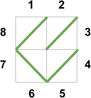

## 문제

You are the Gardener of Seville, a minor character in an opera. The setting for the opera is a courtyard which is a rectangle of unit cells, with R rows and C columns. You have been asked to install a maze of hedges in the courtyard: every cell must contain a hedge that runs diagonally from one corner to another. For any cell, there are two possible kinds of hedge: lower left to upper right, which we represent with `/`, and upper left to lower right, which we represent with `\`. Wherever two hedges touch, they form a continuous wall.

Around the courtyard is an outer ring of unit cells, one cell wide, with the four corners missing. Each of these outer cells is the home of a courtier. The courtiers in these outer cells are numbered clockwise, starting with 1 for the leftmost of the cells in the top row, and ending with 2 \* (R + C) for the topmost cell in the left column. For example, for R = 2, C = 2, the numbering in the outer ring looks like this. (Note that no hedges have been added yet.)

`12   
8  3  
7  4  
 65`

In this unusual opera, love is mutual and exclusive: each courtier loves exactly one other courtier, who reciprocally loves only them. Each courtier wants to be able to sneak through the hedge maze to his or her lover without encountering any other courtiers. That is, any two courtiers in love with each other must be connected by a path through the maze that is separated from every other path by hedge walls. It is fine if there are parts of the maze that are not part of any courtier's path, as long as all of the pairs of lovers are connected.

Given a list of who loves who, can you construct the hedge maze so that every pair of lovers is connected, or determine that this is `IMPOSSIBLE`?

## 입력

The first line of the input gives the number of test cases, T. T test cases follow. Each consists of one line with two integers R and C, followed by another line with a permutation of all of the integers from 1 to 2 \* (R + C), inclusive. Each integer is the number of a courtier; the first and second courtiers in the list are in love and must be connected, the third and fourth courtiers in the list are in love and must be connected, and so on.

Limits

* 1 ≤ T ≤ 500.
* 1 ≤ R \* C ≤ 100.

## 출력

For each test case, output one line containing only `Case #x:`, where `x` is the test case number (starting from 1). Then, if it is impossible to satisfy the conditions, output one more line with the text `IMPOSSIBLE`. Otherwise, output R more lines of C characters each, representing a hedge maze that satisfies the conditions, where every character is `/` or `\`. You may not leave any cells in the maze blank. If multiple mazes are possible, you may output any one of them.

## 힌트

In Case #3, the following pairs of courtiers are lovers: (8, 1), (4, 5), (2, 3), (7, 6). Here is an illustration of our sample output:

For Case #3, note that this would also be a valid maze:

`/\  
\/`

In Case #4, the courtyard consists of only one cell, so the courtiers living around it, starting from the top and reading clockwise, are 1, 2, 3, and 4. There are only two possible options to put in the one cell: `/` or `\`. The first of these choices would form paths from 1 to 4, and from 2 to 3. The second of these choices would form paths from 1 to 2, and from 3 to 4. However, neither of these helps our lovesick courtiers, since in this case, 1 loves 3 and 2 loves 4. So this case is `IMPOSSIBLE`, and the opera will be full of unhappy arias!
