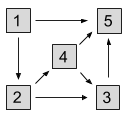

## 문제

Gooli is a huge company that owns B buildings in a hilly area. The buildings are numbered from 1 to B.

The CEO wants to build a set of slides between buildings that she can use to travel from her office in building 1 to her favorite cafe in building B. Slides, of course, are one-way only, but the buildings are tall and have elevators, so a slide can start in any building and end in any other building, and can go in either direction. Specifically, for any two buildings x and y, you can build either zero or one slides from x to y, and you can build either zero or one slides from y to x. The exception is that no slides are allowed to originate in building B, since once the CEO reaches that building, there is no need for her to do any more sliding.

In honor of Gooli becoming exactly M milliseconds old, the design must ensure that the CEO has exactly M different ways to travel from building 1 to building B using the new slides. A way is a sequence of buildings that starts with building 1, ends with building B, and has the property that for each pair of consecutive buildings x and y in the sequence, a slide exists from x to y. Note that the CEO is not requiring that any building be reachable from any other building via slides.

Can you come up with any set of one or more slides that satisfies the CEO's requirements, or determine that it is impossible?

## 입력

The first line of the input gives the number of test cases, T. T lines follow; each consists of one line with two integers B and M, as described above.

## 출력

For each test case, output one line containing `Case #x: y`, where `x` is the test case number (starting from 1) and `y` is the word `POSSIBLE` or `IMPOSSIBLE`, depending on whether the CEO's requirements can be fulfilled or not. If it is possible, output an additional B lines containing B characters each, representing a matrix describing a valid way to build slides according to the requirements. The j-th character of the i-th of these lines (with both i and j counting starting from 1) should be `1` if a slide should be built going from building i to building j, and `0` otherwise. The i-th character of the i-th line should always be `0`, and every character of the last line should be `0`.

If multiple solutions are possible, you may output any of them.

## 힌트

The sample outputs show one possible way to fulfill the specifications for each case. Other valid answers may exist.

Here is an illustration of the sample answer for Case #1:

The four ways to get from building 1 to building 5 are:

* 1 to 5
* 1 to 2 to 3 to 5
* 1 to 2 to 4 to 5
* 1 to 2 to 4 to 3 to 5

In Case #3, building slides from 1 to 2, 2 to 3, 3 to 1, and 1 to 4 would create infinitely many ways for the CEO to reach building 4 (she could go directly to 4, or go around the loop once and then go to 4, or go around the loop twice...), but the CEO requested *exactly* 20 ways.
