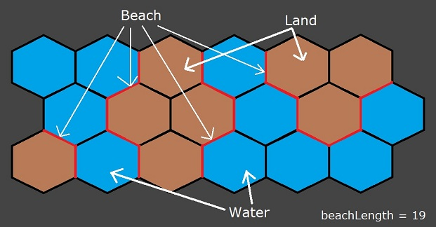

## 문제

단위 정육각형 이루어져 있는 지도가 주어졌을 때, 해변의 길이를 구하는 프로그램을 작성하시오.

해변은 정육각형의 변 중에서 한 쪽은 물인데, 한 쪽은 땅인 곳을 의미한다.

## 입력

첫째 줄에 지도의 세로 크기 N과 가로 크기 M이 주어진다. (1 ≤ N, M ≤ 50)

둘째 줄부터 N개의 줄에 지도가 주어진다. '.'은 물, '#'은 땅이다.

## 출력

첫째 줄에 해변의 길이를 출력한다.
