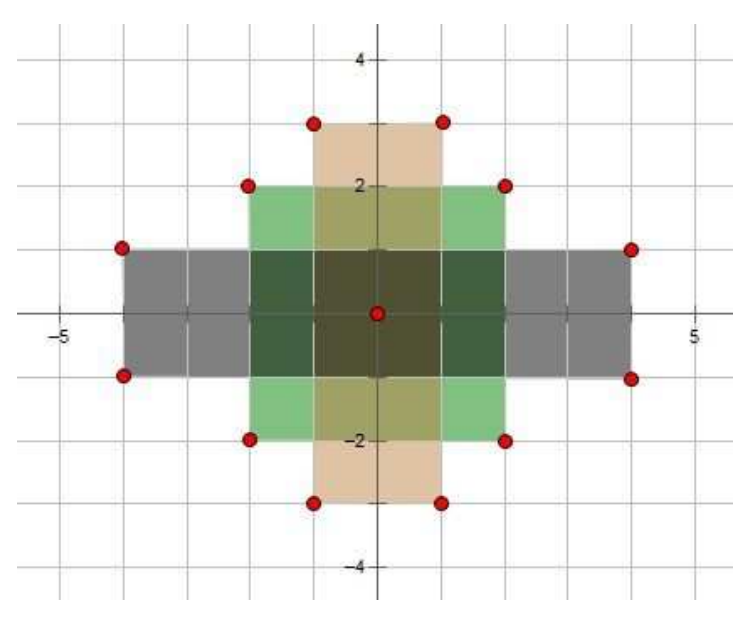

## 문제

직교 좌표계에 존재하는 N개의 직사각형이 주어집니다. 주어진 N개의 직사각형은 중심은 모두 직교좌표계 가운데(원점)이며, 직사각형의 네 개의 변은 좌표축과 평행합니다. 각 사각형은 폭 (x 축을 따라)과 높이 (y 축을 따라)로 고유하게 식별됩니다. 아래 그림은 첫 번째 샘플 테스트를 보여줍니다.

디자인학부 학생인 미추홀 군은 각 사각형을 특정 색상으로 채색했으며, 이제는 종이의 채색된 부분의 면적(넓이)을 알고 싶어합니다. 즉, 미추홀 군은 적어도 하나의 직사각형에 속하는 영역(모든 직사각형의 합집합)의 면적을 알고 싶습니다.

## 입력

첫 번째 입력 줄에는 직사각형 수인 정수 N (1 ≤ N ≤ 1 000 000)이 주어집니다.

다음의 N 행에는 각각 해당 사각형의 크기가 너비(X) 와 높이 (Y)로 주어지며, X와 Y는 모두  짝수인 정수로 (2 ≤ X, Y ≤ 107)범위를 갖습니다.

## 출력

한줄로 색칠된 사각형의 합집합 영역의 넓이를 출력합니다.
