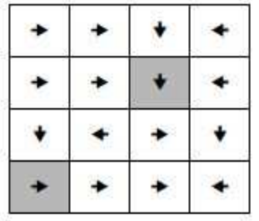

## 문제

Hansel and Gretel are playing a well-known game of “Arrows” that takes place on a board with R rows and S columns. On each field there is exactly one​ arrow that points to one of the four main directions.

Hansel plays first, and his move is to colour exactly K fields on the board that are not located​ in the final column. Gretel then places a robot on an arbitrary field in the first column. Now the robot can move on his own, by moving from the current field to the field that the arrow points to. If at some point the robot is located in the last column, he stops and the game ends.

The winner of the game is determined in the following way:

* If the robot stopped and the game ended, Hansel is the winner if the robot passed through exactly one coloured field, and Gretel is the winner if the robot passed through zero or more than one coloured fields.
* If the robot did not stop after a finite amount of time (in other words, if the robot is stuck in an infinite loop), Hansel is the winner.

We consider that the robot passed through the starting field, through the fields it moved on throughout the game, and the field it was when the game ended. Also, the arrows will be drawn so that the robot never exists outside the board’s boundaries.

Determine whether Hansel can ensure his victory no matter where Gretel initially places the robot. If the answer is positive, output K fields he can colour in order to win.

## 입력

The first line of input contains the integers R, S, K (1 ≤ R \* S ≤ 1 000 000, 1 ≤ K ≤ 50).

Each of the following R lines contains S characters ‘L’, ‘R’, ‘U’ or ‘D’ that denote the direction of the arrow in the corresponding field of the board (L - left, R - right, U - up, D - down).

## 출력

If Hansel cannot ensure his victory, output -1.

If Hansel can ensure his victory, output K lines. In each line, output space-separated numbers A and B (1 ≤ A ≤ R, 1 ≤ B ≤ S) that denote the row and column of the field that Hansel has to colour. All coloured fields must be different.

 If multiple solutions exist, output any.

## 힌트

If Hansel colours the field (4, 2), the robot will pass through it no matter where Gretel initially places it, so Hansel will be the winner.
