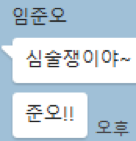

## 문제

대회가 문제 업로드 실수로 인해 지연되어버렸다. 하지만 이는 업로드 실수가 아닌 심술쟁이 해커 임준오(동탄 주민)의 소행이었다! 욱제가 재밌는 사진을 보여주지 않자 심술이 난 준오는 욱제의 대회를 엉망으로 만들려고 한 것이다.

준오는 BOJ 서버가 문제를 찾을 수 없도록 문제의 이름을 암호화해버렸다. 문제 이름은 알파벳 소문자로만 이루어져 있다. 암호화 과정은 다음과 같다.

1. 준오는 문제 이름에서 아무 문자나 골라 k(1 ≤ k ≤ 25)만큼 바꿔버린다. 예를 들어, a를 3만큼 바꾸면 d로, z를 1만큼 바꾸면 a로 바뀐다.
2. 문자를 바꿀 때마다 k를 다시 고른다.
3. k의 합이 s가 될 때까지 문자를 계속 바꾼다. 단, 한 번 바꾼 문자를 다시 바꾸지는 않는다.

욱제는 앞으로 원래 문제의 이름을 몰라도 암호화된 문제를 빠르게 복구할 수 있도록 레인보우 테이블을 만들어 두려고 한다. 문제의 원래 이름이 주어질 때, 이름이 바뀔 수 있는 경우의 수를 구해서 욱제에게 알려주자!

## 입력

첫째 줄에 s(1 ≤ s ≤ 3000)와 둘째 줄에 알파벳 소문자로 이루어진 문제 이름(1 ≤ 길이 ≤ 3000)이 주어진다. 문제 이름에 공백은 없으며, 불가능한 입력(s < k, 25\*길이 < s)은 없다.

## 출력

암호화된 문제 이름의 경우의 수를 1,000,000,007로 나눈 나머지를 출력한다.

## 힌트

ab를 총 2만큼 바꾸는 경우는 ad, bc, cb로 총 3개의 경우의 수가 있다.

hanjo를 총 2만큼 바꾸는 경우는 janjo, hcnjo, hapjo, hanlo, hanjq, ibnjo, iaojo, ianko, … , haojp, hankp로 총 15개의 경우의 수가 있다.
