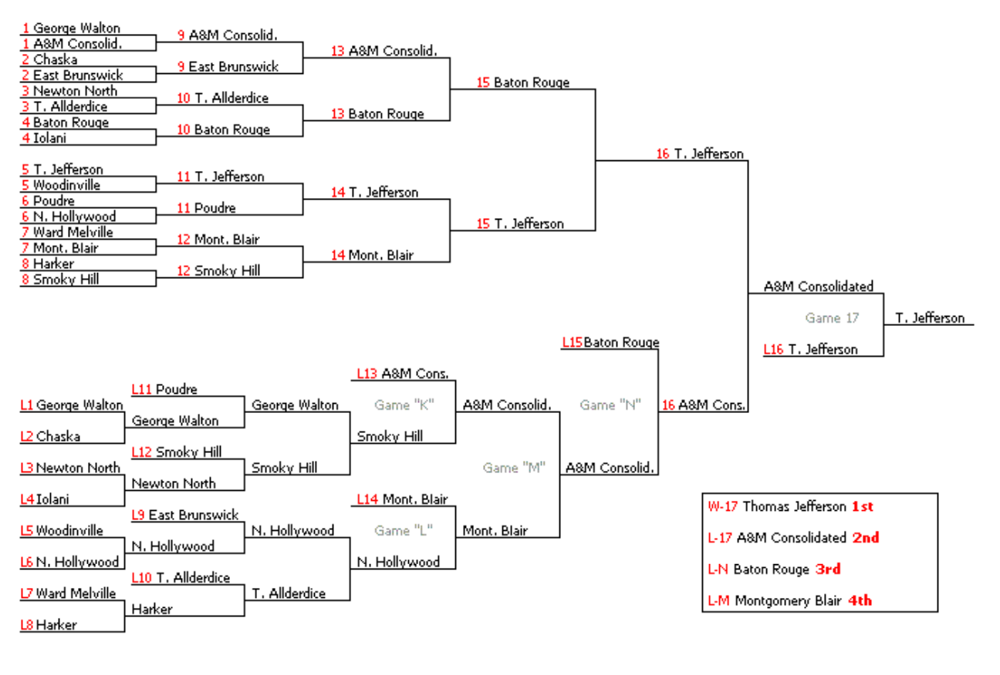

## 문제

Your friend J loves fighting games and plays them night and day. Everytime you try to play with J, he always wins in a crushing victory. You eventually suggest that J enter a fighting tournament, where he can play with people closer to his level. J decides to enter the Street League Pixel Championship, which is a bracketed double-elimination tournament.

Bracketed double-elimination tournaments work as follows. There are two brackets: the winners bracket and the losers bracket. Everyone begins in the winners bracket. Each round, players left in the winners bracket are paired and play matches. Winners remain in the winners bracket and losers drop down to the losers bracket.

Rounds of the losers bracket consist of a minor stage followed by a major stage. Suppose that at the beginning of a round, the losers bracket contains x players. In the minor stage, the x players in the losers bracket are paired and play matches. The x/2 winners from these matches remain in the losers bracket, and the other x/2 players are eliminated from the tournament. When x/2 players drop down from the winners bracket into the losers bracket, the major stage begins, where the new pool of x players are paired and play matches. The x/2 winners of this stage remain in the losers bracket, and the other x/2 players are eliminated from the tournament. This continues until there is only a single player in each bracket. These two players then play a match. If the player from the winners bracket wins, they win the tournament. Otherwise, the player from the player from the winners bracket drops down to the losers bracket and they play a final match (grand finals). The winner of that match wins the tournament.

Since you are a good friend, you watch all of J’s games. J wins w games in the winner’s bracket and ℓ games in the loser’s bracket. What is J’s final rank in the tournament? Participants are ranked by when they are eliminated from the tournament. Everyone eliminated at the same time is considered to be in a tie for the best possible rank they could all be. The winner of the tournament is rank one.

## 입력

The first line of input contains a single integer T (1 ≤ T ≤ 10,000), the number of test cases. The next T lines of input each contain three integers k (0 ≤ k ≤ 30), w, ℓ, representing a valid double-elimination tournament with 2k competitors where J wins w games in the winner’s bracket and ℓ games in the loser’s bracket.

## 출력

For each double-elimination tournament, output a single line with a single integer giving J’s rank.

## 힌트

In the first tournament, there are four competitors. J wins his first game in the winners bracket, after which there are two players in the winners bracket and two players in the losers bracket. J loses his next game in the winners bracket, dropping down to the losers bracket. There is now one player in the winners bracket and two players in the losers bracket. J proceeds to beat the other player in the losers bracket to make it to the finals, where he defeats the winners bracket player twice to take the tournament.

In the second tournament, there are four competitors. J wins two games in the winners bracket to make it to the finals, where he wins to take the tournament.

In the third tournament, there are eight competitors. Believe or not, J drops out immediately, as does one other player, making the two tied for rank seven.
