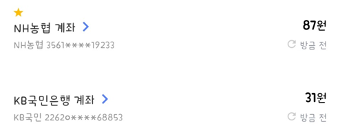

## 문제

슬프게도, 2017 선린 봄맞이 교내대회의 상품 비용은 욱제의 통장에서 충당된다. 욱제의 마음을 아는지 모르는지, 참가자들이 1등 상품으로 치킨을 무려 두 마리(...)나 달라고 조르고 있다.

욱제에게는 두 개의 통장이 있다. 두 통장의 잔고와 치킨 한 마리의 가격이 주어질 때, 욱제가 치킨 두 마리(...)를 살 수 있는지 알아보자.

## 입력

첫째 줄에 두 통장의 잔고 A와 B가 주어진다. (0 ≤ A, B ≤ 1,000,000,000)

둘째 줄에 치킨 한 마리의 가격 C가 주어진다. (0 ≤ C ≤ 1,000,000,001)

## 출력

욱제가 치킨 두 마리(...)를 살 수 있으면 치킨 두 마리(...)를 사고 남은 두 통장 잔고의 합을, 살 수 없으면 현재 두 통장의 잔고의 합을 출력한다.
