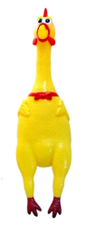

## 문제

욱제에게 미션이 주어졌다! 바로 학급비(서울시민들의 세금)로 구매할 물품을 정하는 것이다. 욱제는 학급비를 낭비(?)할 생각에 신이 났다. 본인(경기도민)이 낸 세금이 아니기 때문이다. 욱제는 낭비(?)에 적합한 두 개의 물품을 정해서 친구들의 의견을 수렴하기로 했다. 그 두 개의 물품은 바로 뽁뽁이와 꼭꼭이이다.

(뽁뽁이와 꼭꼭이)

욱제의 시장조사 결과, 뽁뽁이는 n개의 색상이 있고 꼭꼭이는 m개의 모델이 있다. 욱제는 k명의 친구들에게 다음과 같은 질문을 던졌다: "사고 싶은 뽁뽁이 색상과 사고 싶지 않은 꼭꼭이 모델을 하나씩 고르거나, 사고 싶지 않은 뽁뽁이 색상과 사고 싶은 꼭꼭이 모델을 하나씩 골라라"

욱제는 최대한 많은 친구들을 만족시키고 싶어 한다. 친구들은 자신의 두 요구사항이 모두 반영되어야 만족한다고 한다. 하지만 모두를 만족시키긴 힘들기 때문에 욱제는 만족하지 못하게 되는 친구들에게 미안함의 표시로 사탕을 하나씩 사주려고 한다. (사실 사탕도 학급비이다)

욱제는 최소 몇 개의 사탕을 준비해야할까?

## 입력

첫째 줄에 뽁뽁이의 색상의 수 n, 꼭꼭이의 색상의 수 m, 친구들의 수 k가 주어진다. (1 ≤ n, m ≤ 128, 1 ≤ k ≤ 512)

이후 k개의 줄에 걸쳐 ni, mi, ci가 주어진다. ni와 mi는 뽁뽁이와 꼭꼭이의 색상(모델) 번호를 의미하며 ci가 0이면 ni를, 1이면 mi를 구매하길 원한다는 뜻이다.

## 출력

욱제가 최소  몇 개의 사탕을 준비해야하는지 출력한다.
