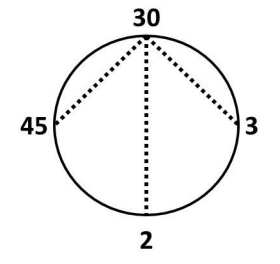
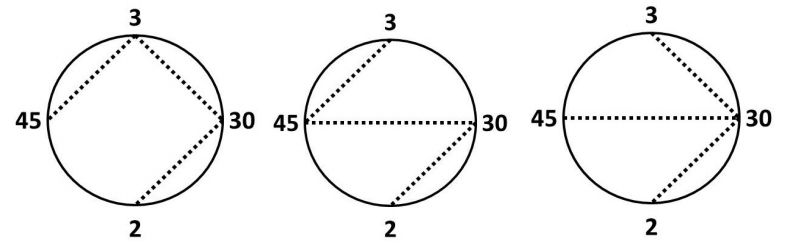

## 문제

Ms. Hall wants to teach her class about common factors. She arranges her students in a circle and assigns each student an integer in the range 2..109 inclusive. She also provides the students with crepe paper streamers. The students are to stretch these streamers between pairs of students, and pull them tight. But, there are some rules.

* Two students can stretch a streamer between them if and only if their assigned integers share a factor other than 1.
* There is exactly one path, going from streamer to streamer, between any two students in the circle.
* No streamers may cross.
* Any given student may hold an end of arbitrarily many streamers.

Suppose Ms. Hall has four students, and she gives them the numbers 2, 3, 30 and 45. In this arrangement, there is one way to stretch the streamers:

In this arrangement, there are three ways to stretch the streamers:

In how many ways can the students hold the streamers subject to Ms. Hall’s rules? Two ways are different if and only if there is a streamer between two given students one way, but none between those two students the other way.

## 입력

Each input will consist of a single test case. Note that your program may be run multiple times on different inputs. The first line of input will contain a single integer n (2 ≤ n ≤ 300), which is the number of Ms. Hall’s students.

Each of the next n lines will hold an integer x (2 ≤ x ≤ 109). These are the numbers held by the students, in order. Remember, the students are standing in a circle, so the last student is adjacent to the first student.

## 출력

Output a single integer, which is the number of ways Ms. Hall’s students can satisfy her rules. Since this number may be very large, output it modulo 109 + 7.
