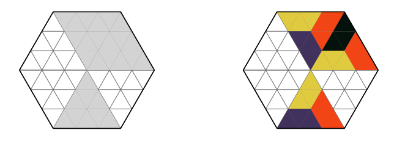

## 문제

We can create a hexagonal puzzle the size of n by dividing a regular hexagon into equilateral triangles by drawing 2n − 1 equidistant parallel lines between each three pairs of opposite hexagon sides. Some of the triangles in the puzzle are shaded and need to be covered with puzzle pieces. Each piece is a trapezoid that consists of three equilateral triangles placed side by side. The pieces come in 6 different colours denoted with numbers from 1 to 6, and we have an unlimited number of pieces of each colour at our disposal.

Slika 1: Puzzle of size 3 from the first sample and one solution.

The goal of the puzzle is to put the pieces on the hexagon so that the following holds:

1. Each piece is placed so it fully covers three shaded triangles.
2. Each shaded triangle is covered by exactly one piece.
3. Two pieces of the same colour do not touch along the side of a triangle (they may touch in a corner).

Determine if it is possible to solve the given puzzle, and, if it is, find one solution.

## 입력

The first line of input contains the positive integer n — the size of the puzzle. The following 2n lines describe the rows of the puzzle from top to bottom. Each of these lines contains a string that describes the triangles in one row of the puzzle from left to right. The digit “0” denotes a shaded triangle, whereas “.” (dot) denotes a triangle that is not shaded. You can assume that at least one triange will be shaded.

## 출력

If the puzzle is impossible to solve, output in the first line “nemoguce” (Croatian for impossible). Otherwise, output 2n lines that describe the solution in the same format as the puzzle is given in the input. Shaded triangles should be denoted with one of the digits from “1” to “6”, instead of the digit “0”. The digits represent the colour of the pieces the triangle is covered with.
