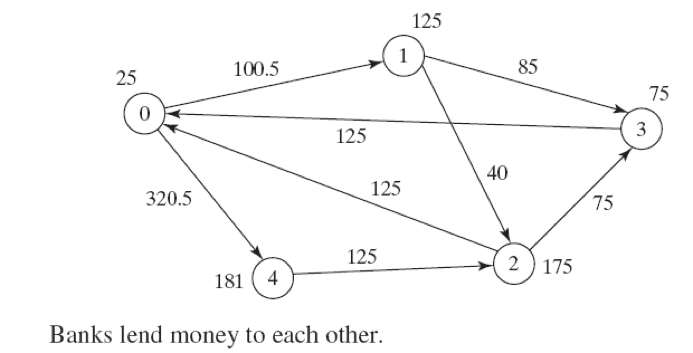

## 문제

Banks lend money to each other. In tough economic times, if a bank goes bankrupt, it may not be able to pay back the loan. A bank’s total assets are its current balance plus its loans to other banks. The diagram in the figure below shows five banks. The banks’ current balances are 25, 125, 175, 75, and 181 million (RM) Ringgit Malaysia, respectively. The directed edge from node 1 to node 2 indicates that bank 1 lends 40 million RM to bank 2.

If a bank’s total assets are under a certain limit, the bank is unsafe. The money it borrowed cannot be returned to the lender, and the lender cannot count the loan in its total assets. Consequently, the lender may also be unsafe, if its total assets are under the limit. Write a program to find all the unsafe banks.

## 입력

The first line has a positive integer T, (1 <= T <= 100), denoting the number of test cases. The test cases are given in the following lines. Each test case start with a line that consist of two integers **n** (1 <= **n** <= 10), where **n** indicates the number of banks and **limit**, (100 <= limit <= 1000) is the minimum total assets for keeping a bank safe. Then there will be **n** lines that describe the information for **n** banks with **IDs** from 0 to **n**-1. The first number in the line is the **bank’s balance**, the second number indicates the **number of banks that borrowed money from the bank**, and the rest are pairs of two numbers. Each pair describes a **borrower**. The first number in the pair is the **borrower’s** **ID** and the second is the **amount** **borrowed**.

## 출력

For each test case produce a single line of output that start with prefix “Case # x:” where x represents the case number (starting from one) followed by the bank ID(s) which is unsafe, in the increasing order of time when the bank is decided unsafe. If multiple banks are decided unsafe at the same time, print their IDs in increasing order.
