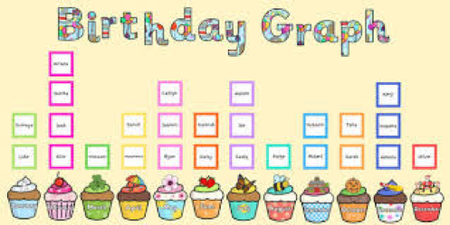

## 문제

Everyone loves to be celebrated on their birthdays. Birthday celebration can encourage positive social interaction among co-workers, foster friendship among classmates or even strengthen bond between families.

Birthday graph can be display in many forms. It can a creative drawing consists of cupcakes, balloons, candles with names, or it can be in the form of simple bar chart to indicate the birthday frequency for the month.

Birthday graph apps will come handy to tabulate birthdates by month especially for a large group. Your task is to write a program that reads a list of birthdates and display the birthday graph as shown in the sample output below.

## 입력

The input consists of a few test cases. For each test case, the first line of input is a positive integer *N* (*N* ≤ 100) which indicates the number of data in the test case. Each of the following *N* lines contains a valid date representing birthdays formatted as dd mm yyyy. Input is terminated by a test case where *N* is 0.

## 출력

For each test case, output a line in the format "Case #x:" where x is the case number (starting from 1), follow by the monthly birthday graph as shown in the sample output.
