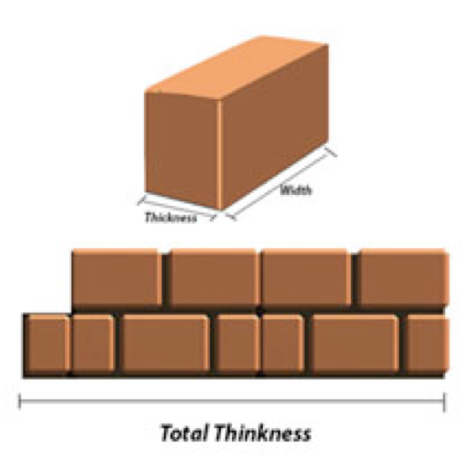

## 문제

Ahmad has *n* bricks. He wants to build a wall using all bricks. He wants the wall’s dimensions to be as small as possible. The thickness of the *i*-th brick is *ti* and its width is equal to *wi*. In Ahmad’s case, the thickness of each brick is either 1 or 2. All bricks have the same heights.

Ahmad puts the bricks on the wall in the following way. First he select some of the bricks and put them vertically. Then he puts the rest of the bricks **horizontally above** the vertical bricks. The sum of widths of the horizontal bricks must be no more than the total thickness of the vertical bricks. A sample arrangement of the bricks is depicted in the figure.

Help Ahmad to find the **minimum total thickness** of the vertical bricks that he can achieve.

## 입력

The first line contains an integer *T*, (1 ≤ *T* ≤ 30) which is the number of test cases. For each case, the first line of input is an integer *n* (the number of bricks), (1 ≤ *n* ≤ 100). Each of the next *n* lines contains two integers *ti* and *wi* denoting the thickness and width of the *i*-th brick correspondingly, (1 ≤ *ti* ≤ 2, 1 ≤ *wi* ≤ 100).

## 출력

For each test case, o the only line of the output print the minimum total thickness of the vertical bricks that we can achieve.
