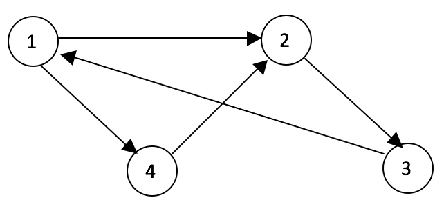

## 문제

Space elevator and shuttle (SES) systems have been setup high above the earth, each involving a number of stations. Stations that are required to deliver high frequency transit are connected directly, while some others are connected via another station in the system.  If a space traveller has to travel from one station to another that is not directly connected, then he/ she will be directed through a route with minimum number of hops necessary to reach the destination.

The figure below shows a SES system involving four stations, where the directed arcs indicate the immediate connections between a pair of stations.  It can be seen that Station 1 is directly connected to Station 2 and Station 4, and it is indirectly connected to Station 3 via Station 2.  In this example, the longest route between any two stations is 3 hops, and there are two such routes in the system, i.e., from stations 2 to 4, and from stations 4 to 1.

A SES system’s connectivity potential is calculated as the product of the number of hops in the longest route and the occurrence of routes with that many hops in the system.  Therefore, the connectivity potential of the SES system shown in the figure above is 3 \* 2 = 6.

## 입력

The first line has a positive integer **T**, (1 <= **T** <= 1000), denoting the number of test cases. The test cases are given in the following lines.  Each test case describes a SES system, which starts on a new line with a positive integer **S** (1 <= **S** <= 40) indicating the number of stations.  The next **S** lines delineate the connections between stations containing either a 1 or a 0, where 1 indicates a direct connection exists from the station on row **i** to the station on column **j**, and a 0 if there is no direct connection.

## 출력

For each test case, produce a single line of output that starts with the prefix “Case #x:” where x represents the case number (starting from one and incrementing at each new test case), followed by a single space, and then the results, i.e., the connectivity potential of the SES system.
