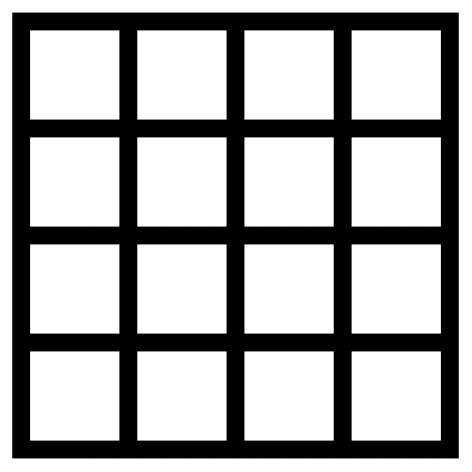

## 문제

Do you know a game called “La cave aux énigmes”? One of its questions is to find the number of squares contained in a grid square of length l. A grid square of length 4 will look like this:

The total number of squares that can be seen in this image is 30. Your task is to find the total number of squares which can be seen in an image of a grid square of length l.

## 입력

The input will begin with a single integer P on the first line, indicating the number of cases that will follow.

The remaining lines of the input will consist of one integer l per line, which is the grid square length. All integers will be less than 1,000,000 and greater than 0.

You should process all integers and for each integer l, determine the total number of squares which can be seen in an image of a grid square of length l.

You can assume that no operation overflows a 32-bit integer.

## 출력

For each integer l, you should output the total number of squares which can be seen in an image of a grid square of length l, with one line of output for each line of input.
