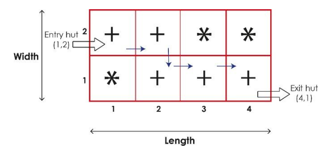
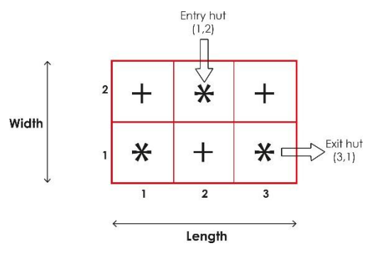

## 문제

A prison has been built as a labyrinth.

The labyrinth is composed of huts labelled + or \*. If you are in hut +, you can only move to another hut + near your hut. One hut is considered near one another if the two huts have a side in common. If you are in hut \*, you can only move to another hut \* near your hut.

The labyrinth can be seen as a rectangle of huts of width W and length L. W and L are integers.

A hut is identified by its position on the horizontal side and by its position on the vertical side of the labyrinth.

In this prison, all huts are “entry huts” but there is only one “exit hut”.

Given the labyrinth, the hut of the prisoner (called entry hut) and the exit hut, your task is to determine if the prisoner can escape.

In the example of Prison A (labyrinth of length 4 and width 2), the prisoner can escape. In the second example (labyrinth of length 3 and width 2), the prisoner cannot escape.

Prison A

Prison B (Typo: Entry hut: (2, 2))

## 입력

The input will begin with a single integer P on the first line, indicating the number of cases that will follow.

Each case begins with a single line made of 6 natural numbers with the following format:

L W A B C D where :

* L is the length of the labyrinth and W is the width of the labyrinth
* A is the length of the entry hut and B is the width of the entry hut of the prisoner
* C is the length of the exit hut and D is the width of the exit hut

followed by W lines containing L characters. Each character will be + or \*.

## 출력

For each prison, print YES if the prisoner can escape and NO if not.
