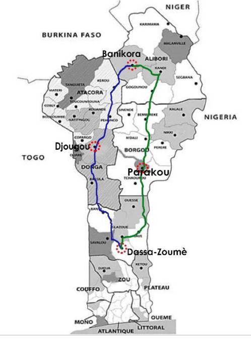

## 문제

Codjo: I am ready for the trip to Banikoara

Bossi: Let us go through Parakou

Assiba: No, the fastest road to go to Banikoara is through Djougou

You are responsible to write a program which, given a list of towns and distances separating these towns, gives the shortest distance to travel from a town A to a town B

## 입력

The first line of input contains a single integer P, (1 ≤ P ≤ 1000), which is the number of data sets that follow. Each data set begins with a line containing the number N of the remaining lines in the dataset (1 ≤ N ≤ 500), followed by a space, followed by the name of a departure town, followed by a space, followed by the name of a destination town. Each of these N lines contains a name of a departure town, followed by a space, followed by a name of a destination town, followed by the distance (in kilometers) between the two towns. The distance will be an integer and the name of town will be a string formed with characters [a-z] [A-Z] and with the sign “-”.

## 출력

For each data set, you must generate a single output line containing the name of a town A and a space, followed by the name of town B, followed by a space, followed by the shortest distance to travel between towns A and B.
