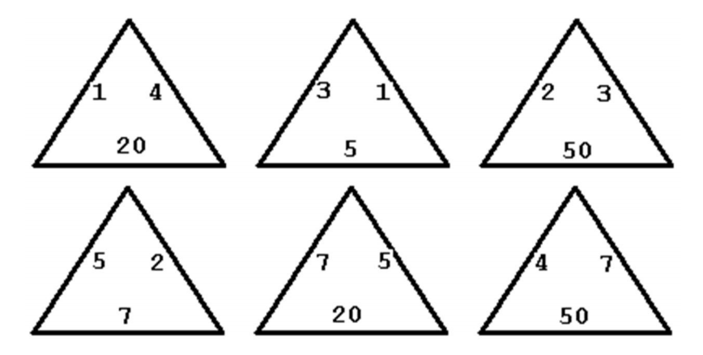
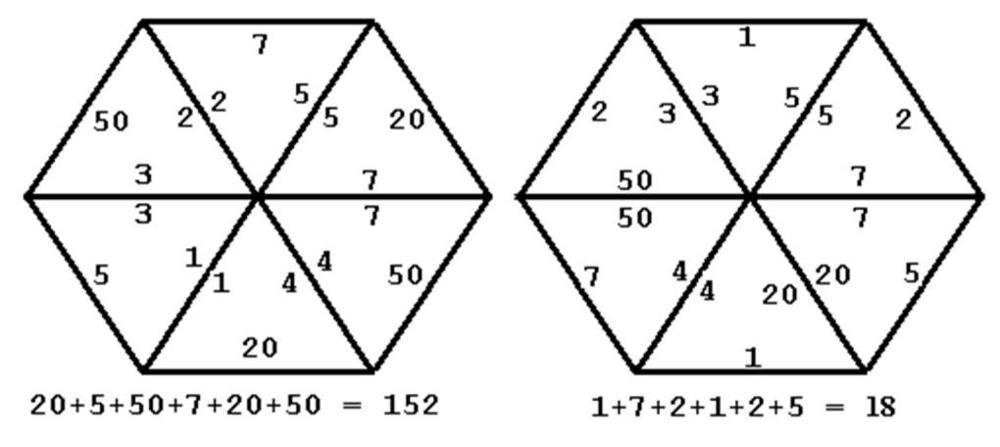

## 문제

In the triangle game you start off with six triangles numbered on each edge, as in the example above. You can slide and rotate the triangles so they form a hexagon, but the hexagon is only legal if edges common to two triangles have the same number on them. You may not flip any triangle over. Two legal hexagons formed from the six triangles are illustrated below.

The score for a legal hexagon is the sum of the numbers on the outside six edges.

Your problem is to find the highest score that can be achieved with any six particular triangles.

## 입력

The input file contain one or more data sets. Each data set is a sequence of six lines with three integers from 1 to 100 separated by blanks on each line. Each line contains the numbers on the triangles in clockwise order. Data sets are separated by a line containing only an asterisk. The last data set is followed by a line containing only a dollar sign.

## 출력

For each input data set, the output is a line containing only the word "none" if there are no legal hexagons or the highest score if there is a legal hexagon.
