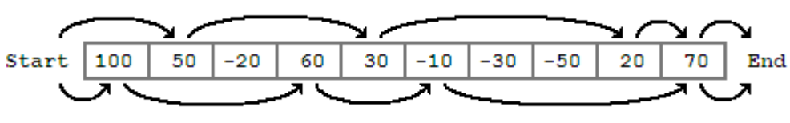
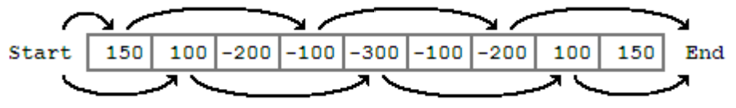

## 문제

일렬로 된 보드가 있다. 맨 왼쪽은 시작점이고, 맨 오른쪽에는 별이 있다. 매 턴마다 플레이어는 1부터 S까지의 자연수가 균일한 확률로 나오는 주사위를 굴린 뒤 나온 수만큼 앞으로 이동한다. 플레이어가 멈춘 칸에는 숫자가 쓰여 있는데, 거기에 쓰인 만큼 (양수일 때) 코인을 얻거나 (음수일 때) 잃는다. T턴이 지나면 게임이 종료된다.

예를 들어 보드가 위와 같고, S=4, T=5라고 하자. 주사위를 굴려서 2, 3, 4, 1, 1이 나오면 총 수익은 170코인이 된다. 반면 주사위를 굴려서 1, 3, 2, 4, 1이 나오면 총 수익은 220코인이 된다. 꼭 별이 있는 칸에 정확히 멈출 필요는 없다. 별이 있는 칸을 지나가면 별을 얻을 수 있기 때문이다.

보드가 안 좋아서 총 수익이 음수가 되어야만 별을 얻을 수도 있다. 아래 보드 (S=4, T=5)의 경우 별을 얻을 때의 최대 수익은 -100코인이다. 하지만 별을 많이 얻는 것이 중요하기 때문에, 플레이어는 코인을 잃는 한이 있어도 별을 얻고 싶어한다.

T턴 이내에 별을 얻고자 할 때, 최대 수익은 얼마일까?

## 입력

입력은 20개 이하의 테스트케이스로 구성되어 있고, 맨 끝에 0이 온다. 각 테스트케이스의 첫 줄에는 N (출발점과 별 사이의 칸 수), S, T가 주어진다. 2 ≤ N ≤ 200, 2 ≤ S ≤ 10, N + 1 ≤ ST, T ≤ N + 1이다. 따라서 T턴 이내에 별을 먹는 방법이 꼭 존재한다.

첫 줄 다음에는 여러 줄에 걸쳐 N개의 정수가 주어진다. 각 칸에 도착할 때 얻거나 잃는 코인의 수를 나타낸다. 이 값의 절댓값은 10000보다 작다.

## 출력

각 테스트케이스에 대해 T턴 이내에 별을 얻을 때의 최대 수익을 출력한다.
