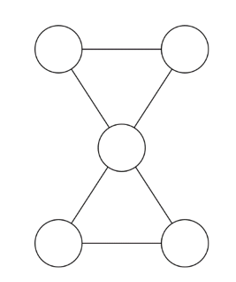
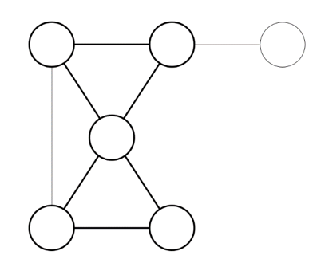

## 문제

모래시계 가공업자 택희는 매일 그래프를 하나 받아 그 안에서 모래시계를 추출하는 작업을 한다.

모래시계는 아래와 같이 생겼다.

좀 더 정확히 말하면, 다음의 조건을 만족하는 부분그래프를 모래시계라 한다.

1. 정확히 길이가 3인 단순 사이클 두 개로 이루어져 있다.
2. 두 단순 사이클은 정확히 한 개의 정점을 공유한다.
3. 두 단순 사이클을 외부에서 잇는 간선은 있든 없든 상관없다.

3번 조건에 대한 예시를 부연설명하자면, 아래와 같은 그래프에서 진한 부분도 모래시계이다.

만일 어떤 두 모래시계에 대해, 두 모래시계에 속한 정점과 간선의 합집합이 두 모래시계 중 어느 한 쪽과 동일할 때, 이 두 모래시계는 동일한 모래시계라고 한다. 이 조건을 만족하지 않는 모든 두 모래시계는 서로 다른 모래시계이다.

택희는 그래프에서 모래시계를 추출하는 작업을 굉장히 빨리 할 수가 있다. 얼마나 빠르냐면, 128MB의 메모리만 있다면 1초 내로 그래프에 존재하는 모든 서로 다른 모래시계의 개수를 셀 수가 있다.

택희에게 한 번 도전해보도록 하자.

## 입력

첫째 줄에 그래프의 정점의 수 N (5 ≤ N ≤ 200), 간선의 수 M (6 ≤ M ≤ $ \frac{N(N-1)}{2} $)이 주어진다.

둘째 줄부터 M줄에 걸쳐 각 간선의 정보가 U V와 같이 주어진다. (1 ≤ U, V ≤ N, U ≠ V)

이는 그래프에 U와 V를 잇는 간선이 존재한다는 의미이다.

어떤 두 정점 사이에는 최대 한 개의 간선만이 존재한다.

## 출력

첫 줄에, 그래프 내에 있는 모든 서로 다른 모래시계의 개수를 출력한다.

모래시계끼리 겹치는(간선이나 정점을 공유하는) 경우에도 서로 다른 모래시계라면 모두 세야 한다.
