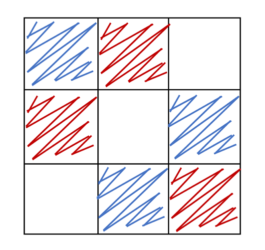

## 문제

영훈이는 n x n격자가 그려져 있는 그림을 가지고 있다.

이때, 영훈이는 그 그림에 빨간색과 파란색을 색칠하려고 한다.

그냥 칠하기에는 너무 재미가 없던 영훈이는 더 재미있는 방법으로 색칠하려고 한다.

영훈이는 각 행에 빨간색 하나와 파란색 하나를 색칠 할 것인데, 이때 각 열에도 마찬가지로 빨간색 하나와 파란색 하나가 색칠되어 있어야 한다.

즉, n = 3 일 때 다음과 같은 그림을 그릴 수 있다.

그림의 크기 N이 주어졌을 때, 영훈이가 색칠 할 수 있는 모든 경우의 수를 구하여라

## 입력

그림의 크기 N (1 ≤ N ≤ 105)이 주어진다.

## 출력

영훈이가 색칠 할 수 있는 모든 경우의 수를 1,000,000,007로 나눈 나머지를 출력하시오.
