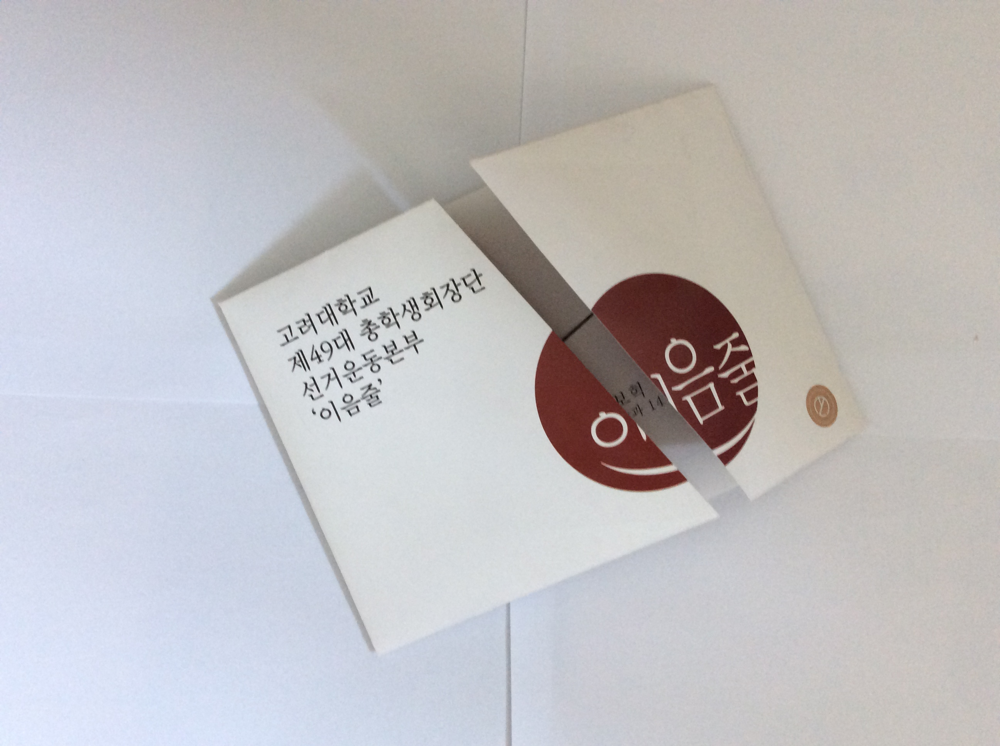
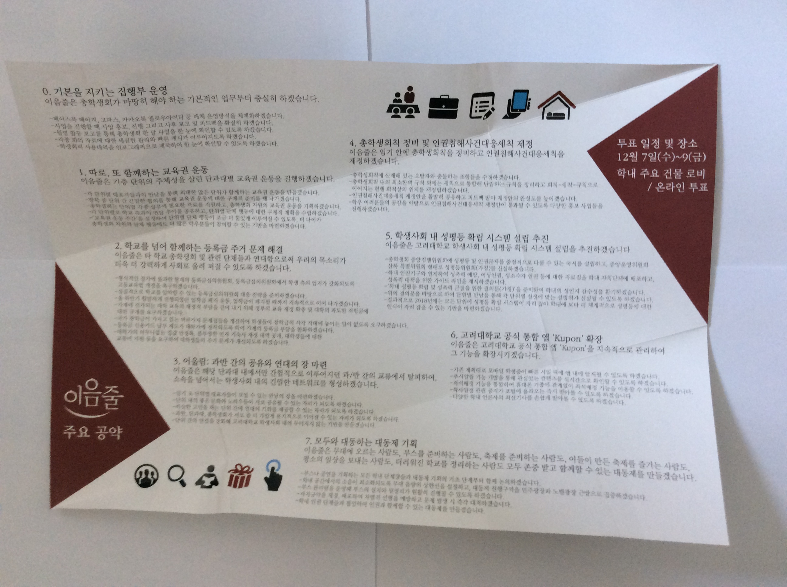
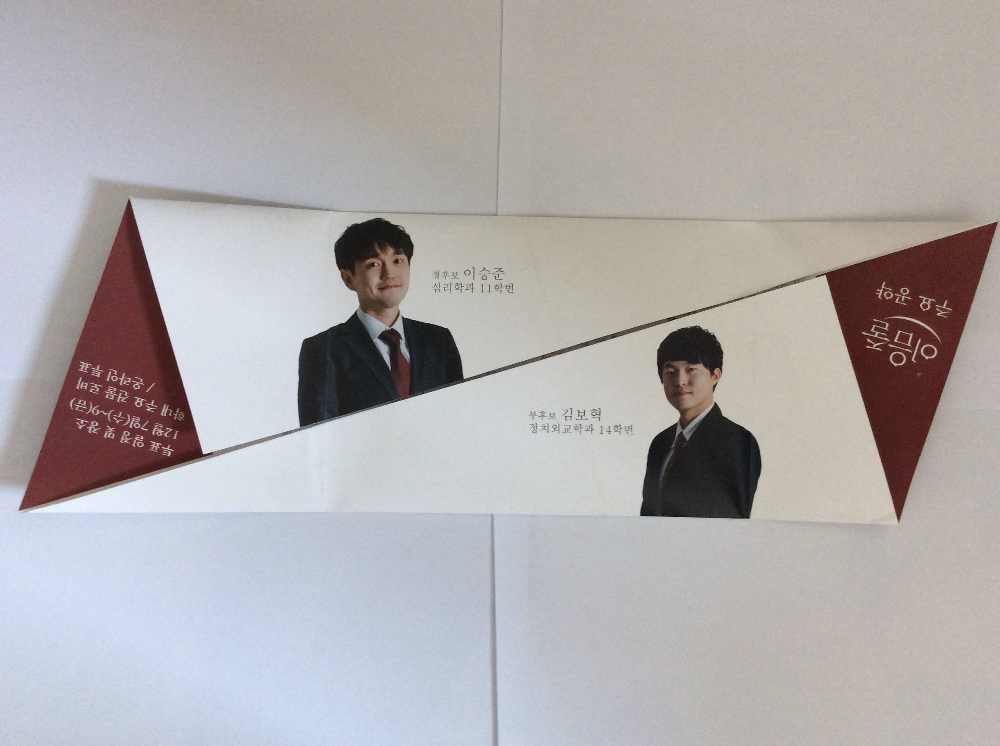

## 문제

이음줄은 고려대학교 제49대 총학생회장단입니다. 이음줄이 작년 가을에 선거운동을 했을 때 이런 포스터를 나눠줬어요.

이 포스터는 신기하게도 접힌 부분을 펼 수 있어요. 접힌 부분을 펴면 다음과 같이 포스터가 펴지죠.

지노는 이음줄 포스터를 보고 감명을 깊게 받은 나머지, 이음줄 포스터와 비슷하게 포스터를 만들어 보려고 합니다. 그러나 지노가 갖고 있는 건 오직 Hcm x Vcm 크기의 직사각형 모양 종이밖에 없어요. 지노가 이 종이를 가지고 포스터를 만들었을 때 어떤 크기의 포스터가 생길까요?

## 입력

첫 번째 줄에 종이의 가로 길이 H, 세로 길이 V가 주어집니다. H와 V는 소수점 아래 두 번째 자리까지 주어집니다. (H > V, 1.00 ≤ H, V ≤ 1000.00)

## 출력

Hcm x Vcm 크기의 종이를 접어서 만든 이음줄 포스터의 가로 길이와 세로 길이 (센티미터 단위)를 출력하세요. 답은 소수점 아래 셋째 자리에서 반올림한 값을 출력합니다. 계산한 답과 정답 간의 오차가 0.01 이하라면 정답으로 간주합니다.
