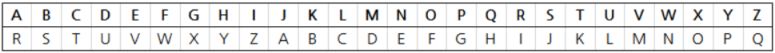

## 문제

로마의 장군 카이사르는 로마군의 작전을 적이 모르게 하기 위하여 암호를 사용했다. 카이사르는 다음과 같이 문장에 있는 모든 알파벳 글자를 몇 칸 뒤의 알파벳으로 바꾸는 방식으로 암호를 만들었다. 아래 표는 모든 글자를 17칸 뒤의 알파벳으로 바꿨을 때 각 글자가 어떤 알파벳으로 바뀌는지 나타낸 표이다.

이 방법에 따라 ‘Baekjoon Online Judge’를 암호화하면 ‘Srvbaffe Feczev Aluxv’가 된다.

당신은 페르시아 군대의 장군으로서 카이사르의 암호를 해독해야 한다. 당신은 카이사르가 어떤 방법으로 문장을 암호화하는지는 알고 있지만 카이사르가 몇 칸 뒤의 알파벳으로 바꾸는지는 모른다. 다행히, 당신의 부하가 로마어 사전을 가져와서 이를 통해 카이사르의 암호를 해독할 수 있을 것으로 보인다. 보통 전령에는 보편적인 단어가 나오기 때문에 사전에 나오는 단어가 반드시 있을 것이다. 따라서 암호를 해독한 후, 해독한 문장에서 사전에 나오는 단어가 반드시 하나 이상 등장해야 한다.

카이사르의 암호와 사전의 정보가 주어졌을 때, 암호를 해독하는 프로그램을 작성하여라.

## 입력

첫 번째 줄에 암호문이 주어진다. 암호문은 소문자로만 이루어진 길이 100 이하의 문자열이다.

두 번째 줄에는 사전에 있는 단어의 수 N이 주어진다. (1 ≤ N ≤ 20)

세 번째 줄부터 N개의 줄에는 사전에 있는 단어가 주어진다. 모든 단어는 소문자로만 이루어진 길이 20 이하의 문자열이다.

## 출력

암호문을 해독하여 나온 원문을 출력한다. 모든 데이터에 대해서 답이 한 가지인 경우만 들어온다고 가정한다.
